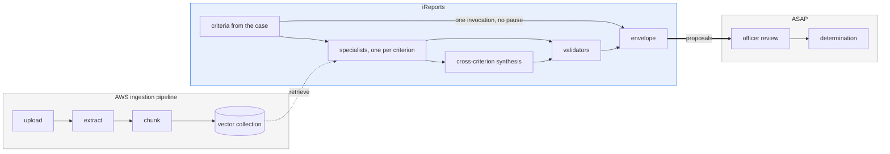
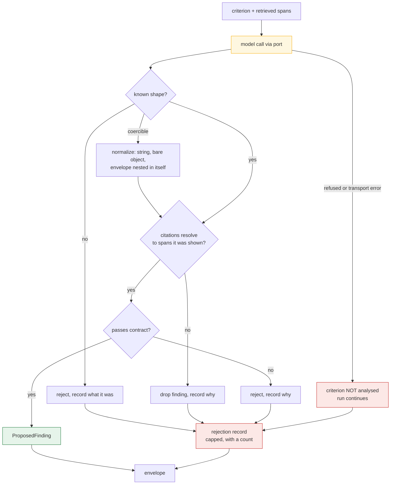
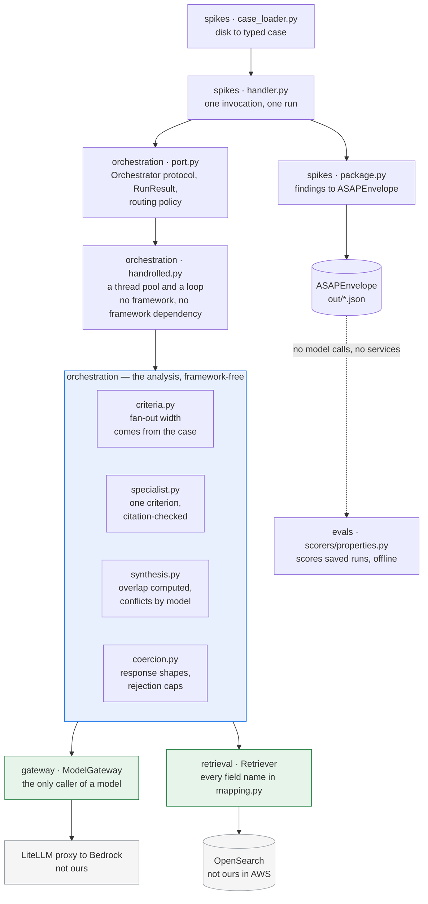
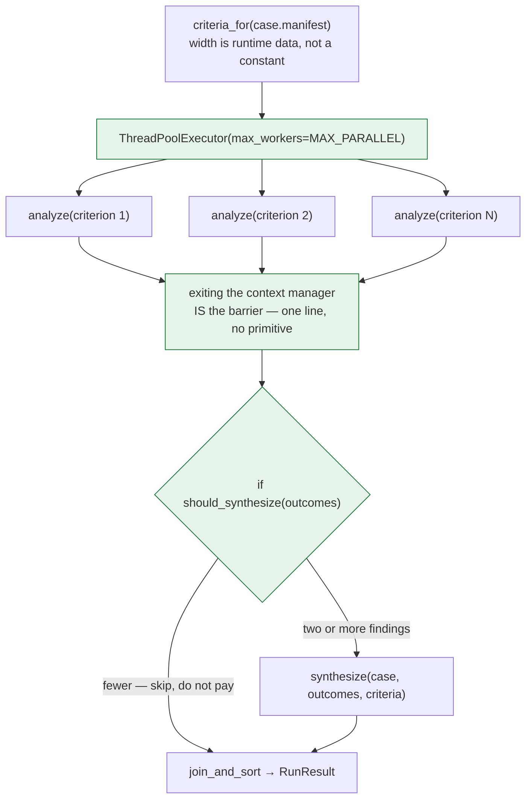

# Architecture

How iReports is shaped and why. Written for a developer who has to build this on the government
side — enough to make the design decisions legible, not an exhaustive specification.

**This is a proof of concept.** Parts of it run against real models today; parts are designed and
not built. § What exists says which is which, and it is the section most worth keeping current.

---

## What the system does

A case is ready. iReports analyzes it against named adjudicative criteria and emits a validated
envelope of **proposed findings**, each one traceable to evidence in the record. An authorized
officer reviews those proposals in ASAP.

That is the whole job. It is deliberately narrow at both ends: iReports does not ingest documents,
and it does not decide anything.



**Three boundaries worth being precise about:**

| Boundary | Who owns it |
|---|---|
| Upload → extract → chunk → index | The AWS ingestion pipeline. We consume the collection, we do not populate it |
| Analysis → proposals | **Ours.** Starts at "the case is ready," ends at a validated envelope |
| Review → determination | ASAP. iReports has no reviewer surface, no pause, and records no human decision |

---

## The one idea that shapes everything

**A deterministic shell around probabilistic reasoning.**

The model reasons. It does not decide control flow, and it does not decide whether its own output is
valid. Everything load-bearing is ordinary code:



Only the yellow box is probabilistic. Shape coercion, citation validation, containment of a
refusal, and the decision-support language guard are all deterministic code. **Budget and loop
limits belong on this diagram and are not on it, because they are not built** — see
[`ROADMAP.md`](ROADMAP.md) item 4.

Two paths here exist because they were once missing. A refusal used to propagate and kill the whole
run, discarding every other specialist's paid-for work; and a response whose `findings` array
arrived as a JSON string was rejected as unparseable rather than coerced. Both are in
[`LESSONS.md`](LESSONS.md).

**The rejection record is output, not error logging.** It ships with the run. A pipeline that hides
its rejections looks cleaner and tells you nothing about where its safety lives.

---

## Two rules that are not negotiable

### 1. Evidence before inference

Every material factual statement in a finding carries a citation to a case evidence span, and the
citation is **checked against the case** before the finding is constructed. A finding citing
evidence that is not in the record is **dropped**, not repaired — trimming the bad citation would
leave an observation standing on evidence nobody can open.

This is the product. A finding an adjudicator cannot trace to a document is worse than no finding.

### 2. The decision-support boundary

The system never grants, denies, revokes, or suspends anything. Structurally:

- **No aggregate risk score.** No "risk level" field exists on any contract.
- **`ProposedFinding` is the only finding type.** Nothing promotes it.
- **No contract models a human decision** — no disposition, approval, or sign-off field.
- **Every envelope is pinned `machine_generated: true`.**
- **Determinative language is rejected** on every narrative field, whoever wrote it.

The prompt asks for decision-support phrasing. The *type* enforces it. When a model wrote "the
subject violated SEAD-4," the prompt had already failed and the type is what stopped it.

---

## Components



**What the picture is meant to show.** Read it top to bottom. The `spikes` boxes hold no analysis
— they load a case, call a port, and package the result. Everything that reasons about a case is in
`packages/orchestration/`, and the two adapters converge on **one** shared analysis block, which is
the ADR-027 arrangement drawn rather than described: swapping the orchestrator changes the two boxes
above that block and nothing inside it.

Green boxes are ports — the only places anything reaches outside. The yellow box is the only module
that knows a framework exists, and a test enforces that against every other module in its package.

`evals/` hangs off the envelope rather than off the run, and that is the design: it scores **saved
output**, so it costs nothing and can be re-run as the checks improve.

| Component | What it is |
|---|---|
| `packages/domain/` | 12 Pydantic v2 contracts + generated JSON Schema. The vocabulary everything else speaks |
| `packages/gateway/` | The **only** component permitted to call a model. One port, three adapters |
| `packages/retrieval/` | Hybrid vector + lexical search, mandatory case filter, every field name in one module |
| `packages/orchestration/` | Criteria routing, multi-step specialists, synthesis, budgets, idempotency, checkpointing, and both orchestrators behind one port. **The reference implementation** |
| `spikes/lambda_demo/` | The runnable wrapper: case loading off disk, envelope packaging, Lambda handler, and the synthetic corpus |
| `spikes/lambda_fit/` | Packaging and cold-start measurement under SAM local |

---

## One orchestrator, and no framework

**Custom Python, behind this project's own port** (ADR-027 chose it; ADR-029 removed the LangGraph
adapter that the comparison ran against). A thread pool and a loop — 47 statements — against ~3,400
lines of shared, framework-free code doing criteria selection, specialists, evidence gathering,
synthesis, budgets, idempotency, checkpointing, and tracing. **That ratio is the finding**: the
orchestrator is the small part, and every framework on offer competes for it.

```python
class Orchestrator(Protocol):
    name: str
    def run(
        self,
        case: LoadedCase,
        gateway: ModelGateway,
        retriever: Retriever,
        run_id: str,
        budgets: Budgets | None = None,
        checkpointing: Checkpointing | None = None,
        cancel: CancellationToken | None = None,
    ) -> RunResult: ...
```

The port survives the decision. Not as lock-in insurance — there is no framework left to be locked
into — but as the seam an entry point plugs into, and as the home of the routing policy
(`should_synthesize`, `stop_reason`, `unstarted`) that having had two implementations forced into
shared code. That lesson outlived the second implementation.

**Nothing shipped imports `langgraph`, `langchain`, or `langsmith`,** and a test enforces it over
every module and every `pyproject.toml` in `packages/`. That is ORCH-04, closed by absence rather
than by a configuration pin.

Full report: [`handoff/orchestration-decision.md`](handoff/orchestration-decision.md). It is scoped
to this proof of concept and **its §5 says what it does not claim.**

### What the comparison measured

Eight capabilities, built twice behind one port over one shared specialist, between 2026-08-12 and
2026-08-19. **Four were null results** — the fan-in barrier, early termination on a budget, resume
across a Lambda invocation boundary, and a bounded loop inside a node. Of the four that were not,
three favoured the hand-rolled path on simplicity, and the fourth — node-level checkpointing — was
the one LangGraph was originally chosen for and is where it came off worst: a first-party
checkpointer saves you the *store* and not the *codec*, and 8 of 24 crash trials lost the write for
a call already paid for, against 0.

The full table, the caveats, and the three named open items are in
[`handoff/orchestration-decision.md`](handoff/orchestration-decision.md). It is not reproduced here,
because two copies of a scorecard is how one of them goes stale.

**What ADR-012 got wrong, specifically.** It chose LangGraph on the cost of a PostgreSQL
checkpointer — two lines against fifty-six. That figure was real and incomplete: strict checkpoint
deserialization, which any CUI-carrying system should require, makes the framework silently return a
`dict` rather than refuse an unknown type, so the state channels need a framework-free JSON codec
anyway. **The first-party checkpointer saves you the store, not the codec**, and the codec is most
of the code.

### The run, drawn

A thread pool and a loop. `docs/handoff/build-guide.md` §6 is the version written for someone
building this from scratch; this is the shape.



Everything green is one line of ordinary Python. `pool.map` never cared how long the criteria list
was, so moving fan-out width from a constant to runtime data required **no change here at all**.


## The model gateway

One port. Application code names a **tier**, never a model:

| Alias | Role |
|---|---|
| `ireports-orchestrator` | Control-flow reasoning |
| `ireports-thinking` | Deep criterion analysis |
| `ireports-fast` | Classification, extraction |

Concrete model IDs live in configuration. A partition, region, or model-generation change is a
config edit. On Bedrock the IDs carry an `anthropic.` prefix — the bare first-party ID fails.

The gateway guarantees four things, each because getting it wrong is silent:

1. **A model is named by alias, never by ID.**
2. **A refusal is never mistaken for an answer.** Refusals return HTTP 200; the adapter checks
   `stop_reason` before touching content and raises.
3. **Raw case text never reaches logs or traces.** Traces carry identifiers, versions, outcomes.
4. **Budgets are accountable.** Every call returns token counts.

See [`AWS.md`](AWS.md) for the two adapters, the region constraint, and **the deployment view** — which AWS services this needs, which are ours, and which of them exist today (none: nothing has been deployed).

---

## Data flow, concretely

```
case.json + evidence.json
   │
   ├─▶ load and validate ──────────────── typed contracts
   │
   ├─▶ select criteria ───────────────── from requested_analyses × policy_pack_ids,
   │                                      so the fan-out width is runtime data
   │
   ├─▶ fan out, bounded by max_parallel
   │     ├── criterion A ──┐
   │     ├── criterion B ──┼── each: model call → parse → check citations → build finding
   │     └── criterion C ──┘
   │
   ├─▶ synthesis ─────────────────────── reason ACROSS criteria:
   │     ├── computed: which findings rest on the same span (set arithmetic, free)
   │     └── model:    contradictions and information gaps
   │
   ├─▶ join, sort by finding_id ───────── deterministic order, so runs are comparable
   │
   └─▶ package ───────────────────────── ASAPEnvelope + rejection record
```

Findings are sorted by ID at the join so two runs produce comparable output. An unordered join makes
every diff noise.

**Synthesis is the second stage, and it is deliberately narrow.** Until it existed the run fanned
out and *concatenated* — when one underlying fact bore on four criteria, four specialists reported
it independently and the reviewer had to work out they were seeing one fact four times. Synthesis
computes that overlap exactly, and spends a model call only on the part that needs judgement.

It may not summarise, rank, or assess. It emits `ProposedFinding`s classified `contradiction` or
`information_gap` — both of which the contract already had — and its output is validated by the
same shell as everything else. A synthesis that concluded something about the person would be the
determination this system must never make, wearing a helpful-sounding name.

**Storage roles are not interchangeable:** PostgreSQL is the system of record for workflow state.
OpenSearch is a retrieval index. Never treat a search index as authoritative for findings or run
state.

---

## What exists

**Runs today, against real models:**

| | |
|---|---|
| Data contracts | 12 Pydantic v2 models + JSON Schema |
| Model gateway | Port + `litellm` / `bedrock` / `stub` adapters. LiteLLM proven live; **bedrock never run** |
| Orchestrator | Custom Python — a thread pool and a loop, behind this project's own port. No orchestration framework, and nothing shipped imports one |
| Criteria selection | Derived from the case manifest, so fan-out width is runtime data |
| Cross-criterion synthesis | Computed overlap + a model pass for contradictions and gaps |
| Citation + contract validation | Enforced, with rejections recorded |
| Envelope packaging | Validated `ASAPEnvelope` |
| Lambda packaging | `sam build --use-container`, invoked locally, envelopes on disk |

**Designed, not built:**

| | Approach |
|---|---|
| Retrieval | OpenSearch vector + lexical, mandatory case filter, bounded K, **all field mappings in one module** |
| Crash / resume | Checkpoint per node; resume in a new process without re-running an in-flight model call |
| Model-call idempotency | The expensive one. Measured today at 11–12 duplicate paid calls per 24 crash trials |
| Budgets and loop limits | Ceilings on model calls, tokens, wall clock, per node and per run |
| Authority routing | Criteria are currently hard-coded; routing from versioned policy packs is designed |
| Ingestion | Not ours (ADR-007) |

**The weakest point, named:** a refused specialist currently produces an empty findings list that is
indistinguishable at the artifact level from a criterion that came back clean. The distinction lives
only in the log. Refusals are expected in normal operation here, so this matters.

---

## Running it

```bash
uv sync
uv run pytest -q                      # offline; no model calls

# the demo — real model calls, ~20s, costs money
uv run python spikes/lambda_demo/build.py
cd spikes/lambda_demo && sam build --use-container --parallel && cd -
uv run --env-file .env python spikes/lambda_demo/run_case.py
```

Envelopes land in `spikes/lambda_demo/out/`. Open one — that file is what the architecture produces.

Everything runs locally except model calls, which go to a real endpoint. There is no offline model
fixture, deliberately: a fixture would let us claim things about model behaviour we have not
observed.

---

## Where to go next

| Document | What it is |
|---|---|
| [`LESSONS.md`](LESSONS.md) | What cost us time. **Read this before building** |
| [`AWS.md`](AWS.md) | GovCloud availability, the region constraint, local↔AWS parity |
| [`DECISIONS.md`](DECISIONS.md) | Why things are the way they are, with reasoning |
| [`../spikes/lambda_demo/README.md`](../spikes/lambda_demo/README.md) | The demo: how to run it, what it proves, what it does not |
