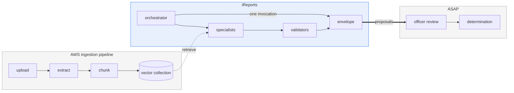
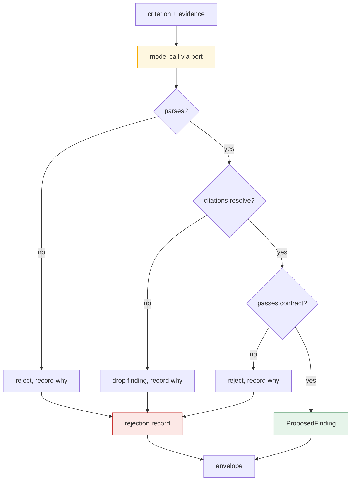
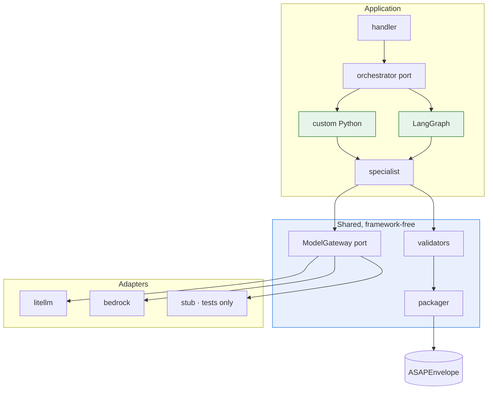

# Architecture

How iReports is shaped and why. Written for a developer who has to build this on the government
side — enough to make the design decisions legible, not an exhaustive specification.

**This is a proof of concept.** Parts of it run against real models today; parts are designed and
not built. § What exists says which is which, and it is the section most worth keeping current.

---

## What the system does

A case is ready. iReports analyzes it against named adjudicative criteria and emits a validated
envelope of **proposed findings**, each one traceable to evidence in the record. An authorized
officer reviews those proposals in ASAP.

That is the whole job. It is deliberately narrow at both ends: iReports does not ingest documents,
and it does not decide anything.



**Three boundaries worth being precise about:**

| Boundary | Who owns it |
|---|---|
| Upload → extract → chunk → index | The AWS ingestion pipeline. We consume the collection, we do not populate it |
| Analysis → proposals | **Ours.** Starts at "the case is ready," ends at a validated envelope |
| Review → determination | ASAP. iReports has no reviewer surface, no pause, and records no human decision |

---

## The one idea that shapes everything

**A deterministic shell around probabilistic reasoning.**

The model reasons. It does not decide control flow, and it does not decide whether its own output is
valid. Everything load-bearing is ordinary code:



Only the yellow box is probabilistic. Schema validation, citation validation, budget and loop
limits, and the decision-support language guard are all deterministic code.

**The rejection record is output, not error logging.** It ships with the run. A pipeline that hides
its rejections looks cleaner and tells you nothing about where its safety lives.

---

## Two rules that are not negotiable

### 1. Evidence before inference

Every material factual statement in a finding carries a citation to a case evidence span, and the
citation is **checked against the case** before the finding is constructed. A finding citing
evidence that is not in the record is **dropped**, not repaired — trimming the bad citation would
leave an observation standing on evidence nobody can open.

This is the product. A finding an adjudicator cannot trace to a document is worse than no finding.

### 2. The decision-support boundary

The system never grants, denies, revokes, or suspends anything. Structurally:

- **No aggregate risk score.** No "risk level" field exists on any contract.
- **`ProposedFinding` is the only finding type.** Nothing promotes it.
- **No contract models a human decision** — no disposition, approval, or sign-off field.
- **Every envelope is pinned `machine_generated: true`.**
- **Determinative language is rejected** on every narrative field, whoever wrote it.

The prompt asks for decision-support phrasing. The *type* enforces it. When a model wrote "the
subject violated SEAD-4," the prompt had already failed and the type is what stopped it.

---

## Components



| Component | What it is |
|---|---|
| `packages/domain/` | 12 Pydantic v2 contracts + generated JSON Schema. The vocabulary everything else speaks |
| `packages/gateway/` | The **only** component permitted to call a model. One port, three adapters |
| `spikes/lambda_demo/` | The runnable proof: case loader, specialist, both orchestrators, packager, Lambda handler |
| `spikes/lambda_fit/` | Packaging and cold-start measurement under SAM local |

---

## Two orchestration paths, on purpose

**Custom Python and LangGraph are both live** (ADR-024). Both sit behind one port; both share one
specialist implementation; both produce the same shape of output.

```python
class Orchestrator(Protocol):
    name: str
    def run(self, case: LoadedCase, gateway: ModelGateway, run_id: str) -> RunResult: ...
```

The hand-rolled path is a `ThreadPoolExecutor` and a loop. The LangGraph path is a `StateGraph` with
one node per criterion. For the current shape — one invocation, in-process fan-out — the framework
is not carrying much weight. Its advantage was concentrated in durable checkpointing, and
checkpointing is not built yet.

**So the decision is deferred until it can be made on evidence**, which means when crash/resume and
model-call idempotency exist. That is the seam where the two genuinely differ.

**The rule that makes this work: no module that analyzes a case may import LangGraph.** A test
enforces it. This began as insurance against lock-in; with two implementations actually running, it
is now the working arrangement.

### What it costs

Every orchestration feature is owed by both paths — budgets, loop limits, fan-out bounds, eventually
checkpointing. The mitigation is to build shared logic once, in framework-free code both
orchestrators call. Where a feature is easy in one and hard in the other, **that is the finding**,
and it belongs in `docs/LESSONS.md`.

---

## The model gateway

One port. Application code names a **tier**, never a model:

| Alias | Role |
|---|---|
| `ireports-orchestrator` | Control-flow reasoning |
| `ireports-thinking` | Deep criterion analysis |
| `ireports-fast` | Classification, extraction |

Concrete model IDs live in configuration. A partition, region, or model-generation change is a
config edit. On Bedrock the IDs carry an `anthropic.` prefix — the bare first-party ID fails.

The gateway guarantees four things, each because getting it wrong is silent:

1. **A model is named by alias, never by ID.**
2. **A refusal is never mistaken for an answer.** Refusals return HTTP 200; the adapter checks
   `stop_reason` before touching content and raises.
3. **Raw case text never reaches logs or traces.** Traces carry identifiers, versions, outcomes.
4. **Budgets are accountable.** Every call returns token counts.

See `docs/AWS.md` for the two adapters and the region constraint.

---

## Data flow, concretely

```
case.json + evidence.json
   │
   ├─▶ load and validate ──────────────── typed contracts
   │
   ├─▶ fan out, bounded by max_parallel
   │     ├── criterion A ──┐
   │     ├── criterion B ──┼── each: model call → parse → check citations → build finding
   │     └── criterion C ──┘
   │
   ├─▶ join, sort by finding_id ───────── deterministic order, so runs are comparable
   │
   └─▶ package ───────────────────────── ASAPEnvelope + rejection record
```

Findings are sorted by ID at the join so two runs produce comparable output. An unordered join makes
every diff noise.

**Storage roles are not interchangeable:** PostgreSQL is the system of record for workflow state.
OpenSearch is a retrieval index. Never treat a search index as authoritative for findings or run
state.

---

## What exists

**Runs today, against real models:**

| | |
|---|---|
| Data contracts | 12 Pydantic v2 models + JSON Schema |
| Model gateway | Port + `litellm` / `bedrock` / `stub` adapters. LiteLLM proven live; **bedrock never run** |
| Both orchestrators | Custom Python and LangGraph, one shared specialist |
| Citation + contract validation | Enforced, with rejections recorded |
| Envelope packaging | Validated `ASAPEnvelope` |
| Lambda packaging | `sam build --use-container`, invoked locally, envelopes on disk |

**Designed, not built:**

| | Approach |
|---|---|
| Retrieval | OpenSearch vector + lexical, mandatory case filter, bounded K, **all field mappings in one module** |
| Crash / resume | Checkpoint per node; resume in a new process without re-running an in-flight model call |
| Model-call idempotency | The expensive one. Measured today at 11–12 duplicate paid calls per 24 crash trials |
| Budgets and loop limits | Ceilings on model calls, tokens, wall clock, per node and per run |
| Authority routing | Criteria are currently hard-coded; routing from versioned policy packs is designed |
| Ingestion | Not ours (ADR-007) |

**The weakest point, named:** a refused specialist currently produces an empty findings list that is
indistinguishable at the artifact level from a criterion that came back clean. The distinction lives
only in the log. Refusals are expected in normal operation here, so this matters.

---

## Running it

```bash
uv sync
uv run pytest -q                      # offline; no model calls

# the demo — real model calls, ~20s, costs money
uv run python spikes/lambda_demo/build.py
cd spikes/lambda_demo && sam build --use-container --parallel && cd -
uv run --env-file .env python spikes/lambda_demo/run_case.py
```

Envelopes land in `spikes/lambda_demo/out/`. Open one — that file is what the architecture produces.

Everything runs locally except model calls, which go to a real endpoint. There is no offline model
fixture, deliberately: a fixture would let us claim things about model behaviour we have not
observed.

---

## Where to go next

| Document | What it is |
|---|---|
| [`LESSONS.md`](LESSONS.md) | What cost us time. **Read this before building** |
| [`AWS.md`](AWS.md) | GovCloud availability, the region constraint, local↔AWS parity |
| [`DECISIONS.md`](DECISIONS.md) | Why things are the way they are, with reasoning |
| [`../spikes/lambda_demo/README.md`](../spikes/lambda_demo/README.md) | The demo: how to run it, what it proves, what it does not |
