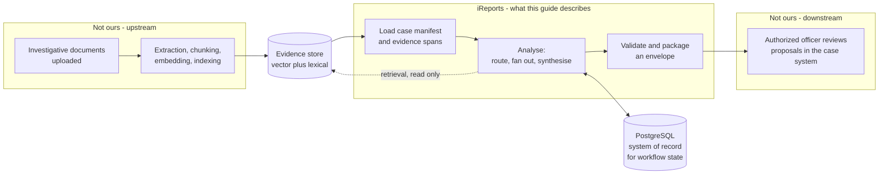
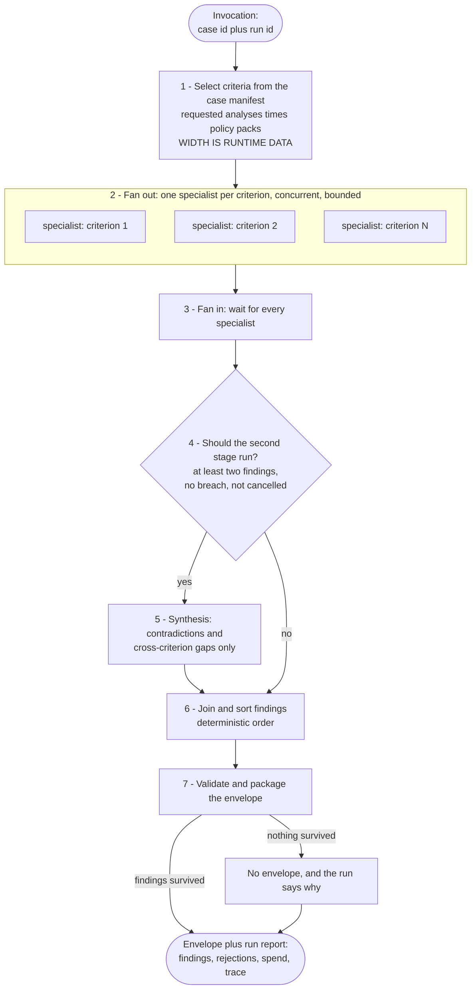
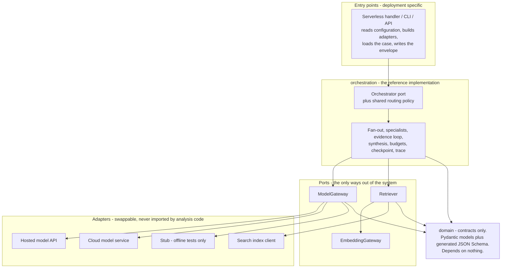
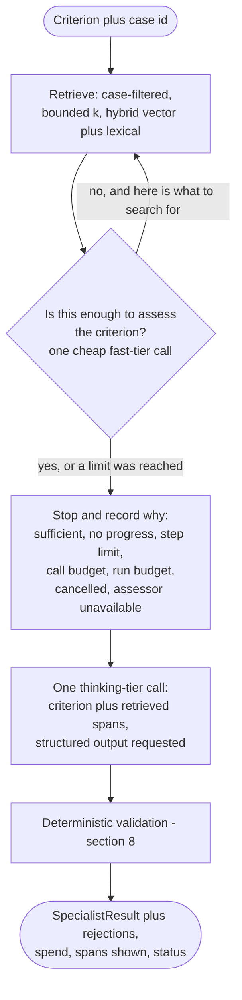
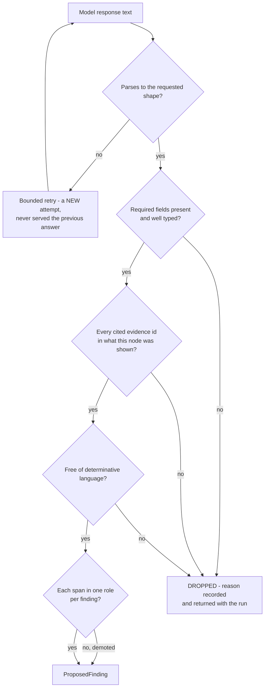
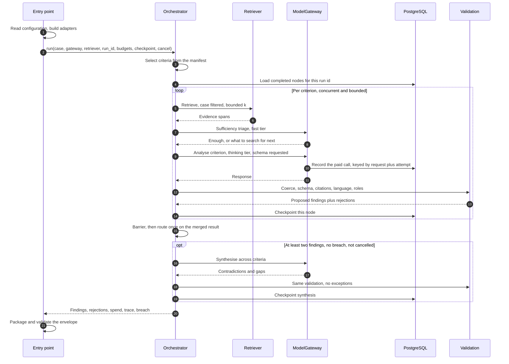

# Building iReports: a reference architecture for the hand-rolled Python implementation

**For:** an engineering team building the production system from this proof of concept.
**Assumes:** Python 3.12+, PostgreSQL, an OpenSearch-compatible vector store, and one model
endpoint. Assumes no orchestration framework — see [`orchestration-decision.md`](orchestration-decision.md)
for why.

This document is the **shape and the reasoning**. It is not an API reference: the contracts are in
[`contracts.md`](contracts.md), what exists today is in
[`component-architecture.md`](component-architecture.md), and the traps that cost someone a day are
in [`../LESSONS.md`](../LESSONS.md). Read §1 and §2 before writing any code; everything after is
reference.

---

## 1. The one rule that constrains every other decision

**The system identifies issues, mitigating information, contradictions, and information gaps for
review by an authorized officer. It must never grant, deny, revoke, suspend, or otherwise make any
determination.**

This is a legal and ethical limit on federal adjudication, not a design preference. It has concrete
consequences you must carry into the code:

| Rule | How it is enforced |
|---|---|
| No aggregate person-risk score | No contract has a score, severity, or risk-level field. A schema-walking test fails the build if one appears |
| Nothing promotes a proposal to a decision | `ProposedFinding` is the only finding type. There is no `Finding` |
| No contract models a human decision | No disposition, approval, sign-off, or `human_reviewed` field anywhere. A test greps the serialized envelope for those words |
| Every envelope is machine-generated | `machine_generated: true` is pinned, not computed |
| Determinative language is rejected | A validator on every narrative text field, applied to model output *and* to anything a developer writes |

**Review happens in the reviewing system, not here.** A run goes start to finish unattended. Do not
add a review pause, a disposition contract, or a reviewer role — if you need one, that is a
different system talking to this one.

Two mechanisms carry the whole boundary: the `ProposedFinding` type and the determinative-language
validator. Treat both as load-bearing. If a change would let the system emit a determination, stop.

---

## 2. Glossary

Terms are used precisely throughout the code. Where two words look interchangeable, they are not.

**Case** — one subject's investigative record, as a manifest plus a set of evidence spans.

**Case manifest** — the routing metadata a run starts from: case id, position, requested analyses,
policy pack ids. It is the *input to routing*, not the evidence.

**Evidence span** — one citable extract of the record: an id, a document id, a page, and text. The
resolvable anchor under every factual claim. Spans are the only thing a finding may cite.

**Decision domain** — the legal authority under which a question is asked: suitability, fitness, PIV
credentialing, national-security eligibility. **These are distinct authorities and collapsing them
produces analysis that is wrong in a way that is hard to detect.** Every finding names exactly one.

**Policy pack** — a versioned body of adjudicative criteria under one authority.

**Criterion** — one thing being checked, under one named authority. Carries a node id, a decision
domain, a policy pack id, a policy id, a criterion id, and the question text put to the model.

**Criteria selection / routing** — deriving *which* criteria this case gets, from the manifest. The
output width is runtime data.

**Fan-out** — dispatching one specialist per selected criterion, concurrently, bounded.

**Specialist / specialist sub-call** — the analysis of exactly one criterion. Sees only the evidence
retrieved for that criterion. Does not see other criteria or their findings.

**Fan-in / barrier** — waiting until every specialist has finished before the next stage begins.

**Synthesis** — the second stage. Reasons *across* criteria and reports only what is invisible from
one: contradictions and cross-criterion information gaps. Never summarises, ranks, or scores.

**Proposed finding** — the only finding type. An observation, why it may be relevant, a recommended
officer action, citations, a classification, and confidences. A proposal, never a conclusion.

**Classification** — what *kind* of thing a finding is, not how bad it is. There is no ranking.
Five values: `potential_issue`, `mitigating_information`, `no_issue_identified` (a specialist may
emit these three), `contradiction`, `information_gap` (synthesis only).

**Rejection** — something the deterministic shell threw away, with the reason. **Rejections are
output, not error logging** — they are returned with the run.

**Envelope** — the validated delivery payload handed to the reviewing system. Refused if no
findings survived validation: "nothing found" is not a claim this system makes.

**Run** — one case analysed once, identified by a run id that every finding id embeds.

**Node** — one unit of orchestrated work: a specialist, or synthesis. Nodes are what get
checkpointed and traced.

**Gateway / model gateway** — the single component permitted to call a model. Everything else asks
it.

**Tier alias** — how code names a model: `orchestrator`, `thinking`, `fast`. Configuration resolves
an alias to a concrete model id. **Application code never contains a model id.**

**Sub-call** — a model call made on a node's behalf that is not its analysis, e.g. the evidence
loop's sufficiency triage. Distinguished by a suffixed node id so it can be counted separately.

**Budget / ceiling** — a limit that *changes what the run does*, not one that is merely recorded.

**Breach** — the first ceiling crossed. Recorded once and quoted identically everywhere.

**Checkpoint** — a completed node's result, stored durably so a resumed run skips it.

**Idempotency / call store** — a record of paid model calls, so a resumed run replays rather than
re-buys.

**Trace** — per-node start and end offsets. Identifiers and timings only, never case text.

---

## 3. System context

What this system owns is narrower than people assume. Ingestion is somebody else's; so is review.



**Two boundaries worth stating explicitly to a new team:**

- **PostgreSQL is the system of record for workflow state.** The search index is a retrieval index
  and is never authoritative for findings or run state.
- **This system is a consumer of the evidence store, never a producer.** If you find yourself
  writing to it outside a local development fixture, the ingestion boundary has moved.

---

## 4. The run, as a process

This is the diagram to put on the wall. Everything else in the guide is a detail of one box.



**Four properties of this diagram that are not decoration:**

1. **The fan-out width comes from the case, not from a constant.** A fixed width is one line in any
   design and teaches you nothing; a runtime width is what makes routing real.
2. **The router runs once, after the barrier, on the merged result.** Deciding per-branch on partial
   state is the single easiest mistake to make here and it fails silently.
3. **Every path reaches the envelope stage, including truncated ones.** A run stopped by a ceiling
   still delivers what it has and says it was truncated. A truncated analysis that silently
   disappears is the worst outcome this system can produce.
4. **"No envelope" is a legitimate ending.** A wholly clean case produces no artifact and a run
   report explaining why.

---

## 5. Modular design and abstraction

Four packages, one dependency direction, three ports.



**The rules that make this hold, in priority order:**

1. **`domain` depends on nothing.** Contracts are the shared vocabulary; a contract that imports an
   adapter is how a vocabulary becomes a coupling.
2. **The gateway is the only component permitted to call a model.** Not "should be" — the only one.
   That single chokepoint is what let idempotency, spend accounting, and tier resolution each be
   built once instead of per node.
3. **No analysis module may import an orchestration framework.** Enforce it with a source scan over
   every module in the package, exempting only the adapter and the registry. A rule you assert is a
   rule that erodes; a rule a test enforces is a rule.
4. **Every field name of the search index lives in one module.** The index schema is the thing most
   likely to differ in your environment, and it should be a one-file change.
5. **Entry points read configuration; libraries read `os.environ`.** A library that loads a `.env`
   from the working directory acquires a hidden dependency on where the process was started, and
   deployed environments have no such file.

---

## 6. How to set up fanning and branching

This is the part people over-engineer. The whole of it is a thread pool, a barrier, and an `if`.

### 6.1 Width comes from the case

```python
def criteria_for(manifest: CaseManifest) -> tuple[Criterion, ...]:
    """Intersect what the case asked for with what the catalog offers."""
    requested = set(manifest.requested_analyses)
    packs = set(manifest.policy_pack_ids)

    selected = tuple(
        c for c in CATALOG
        if c.decision_domain in requested and c.policy_pack_id in packs
    )
    if not selected:
        raise NoApplicableCriteriaError(
            f"case {manifest.case_id} requested {sorted(d.value for d in requested)} under "
            f"packs {sorted(packs)}, and the catalog has no criterion matching both. "
            "Nothing would be analysed."
        )
    return selected
```

Two properties, and the second is the one that gets left out:

- **Return a stable, ordered collection.** Two runs of the same case must fan out in the same order,
  or every diff between them is noise.
- **Raise when the intersection is empty.** A run that analyses nothing and returns successfully is
  worse than a run that fails: it produces a clean-looking result for a case nobody looked at. This
  is the same class of failure as a missing retrieval service, which returns "nothing in the record
  matched" for every criterion and reads exactly like a clean record.

### 6.2 Fan out, with a bound

```python
criteria = criteria_for(case.manifest)
ledger   = BudgetLedger(budgets)
trace    = RunTrace()

def one(criterion: Criterion) -> SpecialistOutcome:
    if checkpoint and (restored := checkpoint.restore(criterion)):
        return restored                          # resumed work costs nothing
    breach, cancel_reason = stop_reason(ledger, cancel)
    if cancel_reason:
        return cancelled(criterion, ...)         # a decision
    if breach:
        return skipped_for_budget(criterion, ...) # a ceiling
    with trace.span(criterion.node_id):
        outcome = analyze(criterion, case, gateway, retriever, run_id, ledger=ledger)
    if checkpoint:
        checkpoint.record(outcome)               # inside the worker, before returning
    return outcome

with ThreadPoolExecutor(max_workers=MAX_PARALLEL) as pool:
    outcomes = list(pool.map(one, criteria))     # exiting the context IS the barrier
```

**Four things in those fifteen lines that took real runs to learn:**

- **Bound the width.** Unbounded fan-out over paid model calls is the failure budgets exist to
  prevent, and it is worse under a platform that retries automatically.
- **Check the ceiling inside the worker, per criterion.** The pool has already queued everything, so
  you cannot un-dispatch work; what you can do is make a criterion reached after the ceiling cost
  nothing instead of a model call.
- **Commit the checkpoint inside the worker, before returning.** That is what lets a crash mid-fan-out
  keep the specialists that finished. Committing after the barrier keeps none of them.
- **Ask the checkpoint before you ask the budget.** Restored work costs neither money nor time;
  skipping it to save resources would mean redoing work in order to save resources.

### 6.3 Branch once, after the barrier

```python
breach, cancel_reason = stop_reason(ledger, cancel)
synthesis = None
if breach is None and not cancel_reason and should_synthesize(outcomes):
    with trace.span("synthesis"):
        synthesis = synthesize(case, tuple(outcomes), criteria, gateway, run_id)
```

```python
def should_synthesize(outcomes: list[SpecialistOutcome]) -> bool:
    """Fewer than two findings cannot contradict each other, so the call would be
    paid for and guaranteed useless."""
    return sum(len(o.findings) for o in outcomes) >= 2
```

**Put the routing predicate in shared code, not inside the orchestrator.** It is a *policy* decision
about the run. If two implementations each decide it separately they will eventually disagree, and
the disagreement will surface as two runs of the same case producing different envelopes for a
reason nobody can see.

### 6.4 Prove it actually fans out

Width and a ceiling do not prove concurrency — a sequential loop satisfies both. Record per-node
start and end offsets and assert **peak concurrency > 1**, that the peak equals the bound rather
than the width, and that synthesis starts after the last specialist ends. Then run the same
orchestrator twice, once taking the synthesis branch and once not, and assert the presence and
absence of that node's span: `synthesis is None` on its own is equally consistent with a stage
nobody wired up.

A real run's timeline, five criteria at a bound of three:

```
foreign_influence_specialist         |###################             |   0.01-46.65s
personal_conduct_specialist          |##################              |   0.01-43.24s
financial_considerations_specialist  |################                |   0.01-38.17s
candor_specialist                    |                #############   |  38.18-70.61s
criminal_conduct_specialist          |                  ########      |  43.24-62.44s
synthesis                            |                           #### |  70.62-103.45s
```

---

## 7. Inside one specialist

A specialist is the only place that reasons about a case, and it is deliberately small.



**Bound the loop at every edge** — steps, model calls per node, evidence per node, the run ledger, a
no-progress detector, and a cancellation token. Every stop reason is a *different fact* about how
complete that criterion's evidence is, and collapsing any two of them misreports the run.

**Scope citation checks to what the specialist was shown**, not to the whole case. With retrieval
those differ, and validating against the case would let a model cite a span it never saw — which is
indistinguishable from a lucky hallucination.

**Honest note from our measurements:** on two synthetic cases the sufficiency check asked for more
evidence once in ten criteria, and that one refinement surfaced nothing new. The machinery is
proven; the value is not. Build the loop, keep the ceilings, and measure before you assume it earns
its cost.

---

## 8. Validation: the deterministic shell

The model reasons. It does not decide control flow, and it does not decide whether its own output is
valid.



**Drop the finding; never repair it.** A finding citing evidence that is not in the case is not
salvageable by trimming the citation — the claim rested on something that does not exist.

**Structured output is a request, not a guarantee.** Roughly one call in three came back in an
unusable shape at some point during this project: the array as a JSON string, a bare object instead
of an array, a nested wrapper. Coerce the shapes you have actually observed, in one shared module,
and reject the rest loudly. A coercion living in a private helper protects exactly one call site —
we learned that when a second call site produced 4,547 rejections and zero findings.

**Put the attempt number in any deduplication key.** A retry and a resume are the same request with
opposite intentions, and nothing in the request distinguishes them.

**Cap rejection lists.** Four thousand copies of "not an object" is not a diagnostic; it is what
hides the two rejections that mattered.

---

## 9. System prompts

Three prompts, three jobs, reproduced **verbatim** from the implementation — a test asserts these
blocks match the source, so they cannot drift out of this guide. Their *structure* is the reusable
part: a role, a numbered rule list in priority order, and explicit permission to return nothing.

### 9.1 Specialist — one criterion

```text
You analyze federal background-investigation records against one named criterion.

You are a decision-support component. You never decide anything. An authorized adjudicative
officer reviews everything you produce, in a different system, after you have finished.

Rules, in order of importance:

1. NEVER state or imply a determination. Not "unsuitable", not "should be denied", not "violated",
   not "is deceptive", and no prediction of future conduct. Write what the record shows and why it
   may be relevant. A reviewer decides what it means.
2. CITE EVERYTHING. Every observation must reference the evidence_id values it rests on. If you
   cannot cite it, do not write it. Citing an id that was not given to you is worse than silence.
3. REPORT MITIGATION AS DILIGENTLY AS CONCERN. A record with explanation, resolution, or context
   that cuts against a concern must say so in mitigating_evidence. An analysis that lists only
   what looks bad is a defective analysis.
   ONE ROLE PER SPAN: within a single finding, an evidence_id may appear in supporting_evidence
   OR in mitigating_evidence, never in both. Decide which role that span plays in this finding.
   If a span both establishes a fact and softens it, cite it where it carries the most weight and
   describe the other side in your observation text.
4. AN EMPTY FINDINGS ARRAY IS A GOOD ANSWER when the record shows nothing relevant to this
   criterion. Do not manufacture a finding to appear thorough, and do not manufacture one just to
   report that you found nothing - if the record says nothing on this criterion, return [].
5. CLASSIFY EVERY FINDING, and classify honestly. The classification says what KIND of thing the
   finding is. It is not a severity and there is no ranking.
   - potential_issue: the record shows something a reviewer should look at.
   - mitigating_information: the record shows something that cuts AGAINST a concern - an
     explanation, a resolution, a documented third-party error, a voluntary disclosure. A record
     whose concerning-looking item is fully explained is mitigating information, not an issue.
   - no_issue_identified: the record affirmatively establishes an absence - a criminal history
     check that returned nothing, a consistency review that found no discrepancy. This is a real
     finding backed by a real span. It is NOT the same as having nothing to say, which is [].
   Labelling resolved or exculpatory material as potential_issue misrepresents the record to a
   reviewer as surely as missing a concern does.
6. NAME THE GAPS. If the record is missing something a reviewer would need, say so in
   information_gaps rather than reasoning past it.
```

### 9.2 Synthesis — across criteria

```text
You review findings that separate analysts produced about one case, each looking at a
single criterion in isolation. None of them saw the others' work.

Your job is only what is invisible from a single criterion:

1. CONTRADICTIONS — two parts of the record that cannot both be accurate. A contradiction is
   between *assertions in the record*, not between two analysts' opinions. Cite at least two
   evidence ids: the spans that conflict.
2. INFORMATION GAPS — a question a reviewer would need answered, visible only across criteria.

Rules:

- NEVER state or imply a determination, a conclusion about the person, or a recommendation about
  any adjudicative outcome. You describe the record.
- NEVER summarise, rank, score, or give an overall assessment. There is no such thing here.
- DO NOT restate a finding that a single analyst already made. If it was visible from one
  criterion, it is not yours.
- ONE FACT REPORTED UNDER SEVERAL CRITERIA IS NOT A CONTRADICTION. It is normal and is already
  computed elsewhere. Do not report it.
- EMPTY ARRAYS ARE THE RIGHT ANSWER when there is nothing across criteria. Most cases have few
  genuine contradictions. Do not manufacture one to appear useful.
```

### 9.3 Sufficiency triage — cheap, and not analysis

```text
You decide whether a set of retrieved case excerpts is sufficient to assess one adjudicative criterion. You do not analyse the record and you do not reach any conclusion about the subject. You answer two questions: is there enough here, and if not, what search would find the rest.

Say sufficient=true when the record is adequate — including when it adequately shows that nothing relevant to this criterion is present. An absence that the record establishes is a real answer, not a gap.

Ask for more only when a further search would plausibly surface something material. Asking reflexively costs a paid call and returns the same spans.
```

### 9.4 What makes these work

- **The prompt asks; the type enforces.** Rule 1 above is a request. The validator that rejects
  determinative language is the control. Never rely on the prompt for a property you can check.
- **Give explicit permission to return nothing.** Without it, a model on a clean record will
  manufacture a finding to look useful. Our first deliberately-clean case proved this.
- **Ask the model to classify; do not infer classification from field occupancy.** A finding citing
  a span that supports a *resolution* is structurally identical to one citing a span that supports a
  *concern*. The difference is meaning.
- **Version the prompt and record the version on every finding.** Two materially different prompts
  sharing a provenance string are indistinguishable in the record afterwards.
- **Never put a model id in a prompt or in code.** Name a tier; let configuration resolve it.

---

## 10. Data flow, end to end



**What crosses which boundary, and what must not:**

| Carries | Case text? | Notes |
|---|---|---|
| The envelope | **Yes** | Bounded evidence excerpts, so a finding is reviewable on arrival |
| Model requests | **Yes** | Retrieved spans are the evidence the model reasons over |
| Checkpoints and the call store | **Yes** | They hold results; treat both as a trust boundary — see below |
| Logs | **No** | Identifiers, counts, timings, outcomes |
| Traces | **No** | Node ids and offsets only |
| Telemetry to any third party | **No** | Pin it closed and prove it closed at every entry point |

**Two storage rules that are not optional:**

- **Store JSON and re-validate on read. Never a pickle, never a live object graph.** A checkpoint is
  a deserialization trust boundary in *any* design; one framework accrued four deserialization RCEs
  on its checkpoint path in nine months. Re-entering data through ordinary constructors means a
  tampered row produces a bad value rather than a running one.
- **First write wins.** `ON CONFLICT DO NOTHING`, never `DO UPDATE`. The first recorded answer is
  the one that was paid for and the one a finding's provenance refers to; letting a later write
  replace it rewrites history about what produced a finding.

**Known gap, stated rather than hidden:** row integrity is unaddressed in the proof of concept. A
tampered row that still parses would be restored as though the model produced it. Re-validation
catches a row that no longer satisfies the contracts; it catches nothing about a well-formed forgery.
Sign or MAC the rows before anything real runs on this.

---

## 11. Surviving the platform

Two different resources, two different mechanisms, and conflating them wastes one of them.

| | Where it lives | What losing it costs |
|---|---|---|
| Not re-paying for a completed model call | The **gateway**, framework-free | **Money** |
| Not re-executing a completed node | The **orchestrator** | **Wall clock** |

On a platform that kills long invocations and retries automatically, both matter and wall clock is
usually the scarcer one. Three rules:

1. **Stop at your own ceiling before the platform stops you.** That is the only moment you get to
   checkpoint. If the platform exposes its own remaining-time clock, use it — it knows the real
   timeout and how much is already spent; your configured budget is a guess that stays as backstop.
2. **Record only work that happened.** Completed and refused are checkpointed. Budget-skipped,
   cancelled, and failed are not — those are the next invocation's work, and recording them makes
   the first stop permanent.
3. **A refusal is a result, not an error.** It was paid for. Replay it as a refusal; do not re-ask a
   question the model has already declined.

Measured across a real invocation boundary: an invocation stopped by a ceiling completed three of
five criteria; the next invocation restored those three and ran only the outstanding two. **Six paid
calls in total, against six for one uninterrupted run.**

---

## 12. Conventions

Adopt these or replace them deliberately. Each one is here because its absence cost something.

**Contracts**

- Prefix every id by type — `run_`, `ev_`, `case_`. A transposed id then fails at the door instead
  of deep inside a validator. Note the corollary: an id that embeds another (a finding id embedding
  a run id) fails on *every finding* when the run id is malformed, which reads exactly like model
  nondeterminism. Validate the outer id at the entry point.
- Generate JSON Schema from the models and check it in CI. A schema that has drifted from the model
  is worse than no schema.
- **Distinct facts get distinct values.** `completed with no findings` and `refused` are different;
  so are `skipped because a ceiling fired`, `cancelled by decision`, and `failed`. Every time this
  project collapsed two of them, it misreported a truncated analysis as a complete one.

**Code**

- Rejections are returned with the run, never only logged.
- Ceilings are checked *before* spending, never after. A ceiling consulted once the call has
  returned records an overspend rather than preventing one.
- A fact and a measurement of a fact are different things. Compute a breach once and quote it
  everywhere; a value recomputed on read gave one run two different numbers for one event.
- Contain a node's failure at the node. One refusal must never take down four other specialists'
  completed, paid-for work.
- Type-check the whole tree, tests included, at the strictest setting you can hold. Moving code into
  a checked tree found a real bug on the first run, and the tests are where the checker earns most.

**Tests**

- **Assert the mechanism, not the outcome.** A count is what a correct implementation produces and
  also what several incorrect ones produce. Every fan-out test in this project passed on a
  deliberately serialised implementation until we asserted overlap in time.
- **Every guard needs a negative control.** A check that has never been shown to fire is
  indistinguishable from one that cannot. Verify by breaking the thing on purpose.
- **A test that cannot fail is worse than no test.** We wrote one for the breach-consistency
  property; against a fast stub, both measurements rounded to the same decimal and it passed
  regardless. The real test injected a clock.
- Run what CI runs, with CI's scopes. A narrower local command is how a build goes red.

**Documentation**

- Update the doc in the commit that changes the behaviour. This convention is the only thing keeping
  documentation honest, and it is exactly the one that fails first.
- Make claims checkable. A build-state table that a test parses cannot quietly go stale; prose can.
- Cite it or mark it unverified. This gets read by people who cannot easily check your work.
- Record the trap next to the code that avoids it, and index it centrally. The comment at the fix is
  the version people actually read.

---

## 13. Build order

Roughly what we would do again, in this order. Each step is runnable before the next begins.

| # | Step | Why here |
|---|---|---|
| 1 | Contracts and their JSON Schema | Everything else is typed against them, and the boundary rules live in the types |
| 2 | Model gateway port plus one adapter and a stub | The chokepoint that makes later work single-place |
| 3 | One specialist, one criterion, evidence handed in | The smallest thing that produces a real proposed finding |
| 4 | Validation: coercion, citations, language, roles | Before fan-out, or you will debug five copies of one bug |
| 5 | Criteria selection and bounded fan-out | Width from the case, not a constant |
| 6 | Retrieval behind a port | Specialists fetch their own evidence; citations scope to what was shown |
| 7 | Synthesis plus the routing predicate | The first branch |
| 8 | Budgets that change control flow | Prerequisite for everything in §11 |
| 9 | Idempotency at the gateway | Cheapest large win; both money and correctness |
| 10 | Node checkpointing and resume | Wall clock, and the platform boundary |
| 11 | Trace, and the tests that prove fan-out and branching | Evidence a reviewer can inspect |
| 12 | Envelope packaging and delivery | Last, because it is the easiest to change |

**Two things to schedule that are easy to defer forever:** a synthetic case that is *deliberately
clean* — it is the only way to learn whether the system manufactures concern to look thorough, and
ours found a hard-coded classification that had been wrong since the day it was written — and
ground-truth agreement scoring against analyst-identified findings, which is the half of validation
that property checks cannot cover.

---

## 14. What this guide does not cover

Stated plainly so nobody mistakes silence for completeness.

- **Ingestion.** Upload, extraction, chunking, embedding, and indexing belong upstream.
- **Authority routing from policy packs.** Criteria selection here intersects what the case asked for
  with a static catalog. It cannot decline a criterion or add one, and real routing needs approved
  policy content.
- **A specialist tool surface.** Specialists retrieve and call a gateway; there is nothing else they
  can do. The moment one can *choose* between capabilities, you need an allowlist and a threat model.
- **Multi-tenant isolation, retention, and records management.**
- **Anything measured on real infrastructure.** Every number in this guide comes from local runs
  against a proxied model endpoint and a local emulator. Nothing here has run in a production cloud
  partition.
