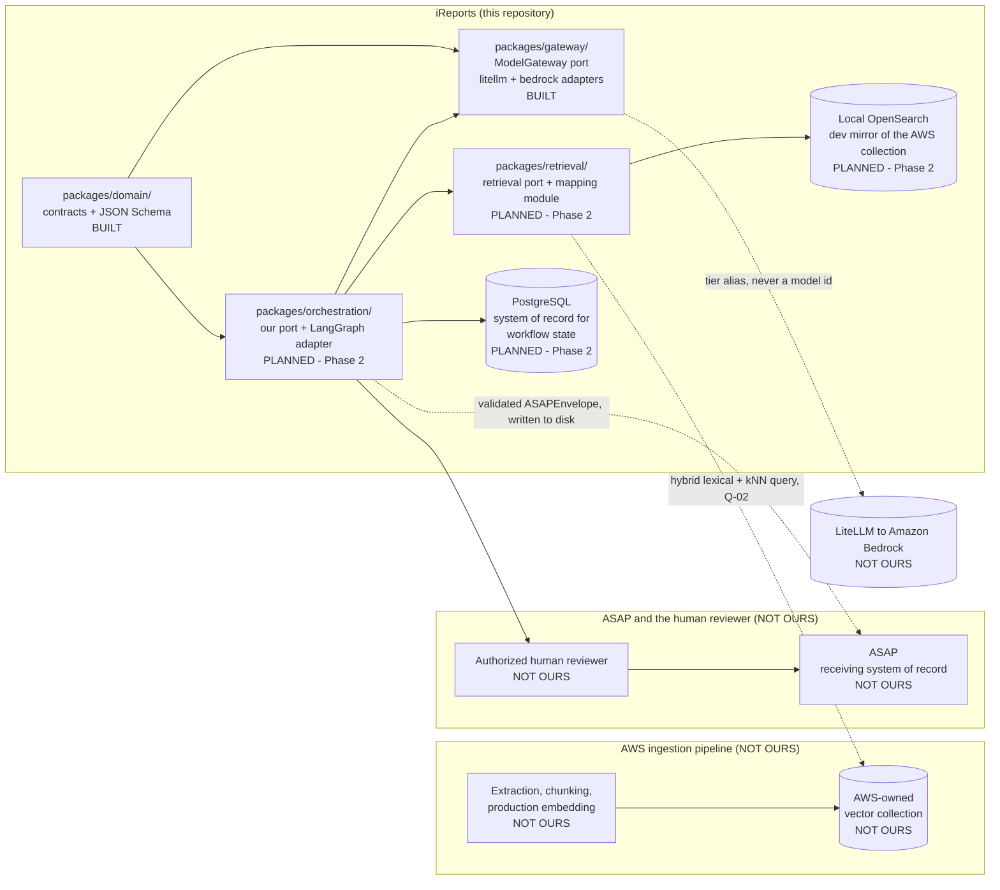
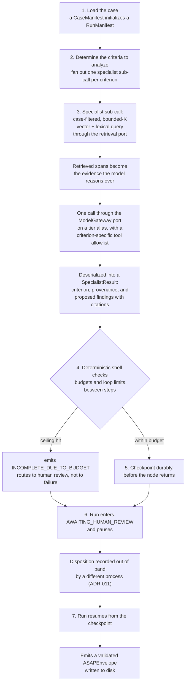

# Component Architecture

**Milestone 1a** · **Date: 2026-08-11** · **Status: complete — closes Milestone 1a**

This is the last item blocking program sign-off on Milestone 1a. It marks the component
boundaries of the iReports reference implementation — what is ours, what the AWS ingestion
pipeline owns, what ASAP owns, and where the human review gate sits — and it separately marks
what ADR-020 designed and did not build, so that "coming in a later phase" and "deliberately not
coming" are never left for a reader to infer.

> **Claim tagging**, as in `orchestration-landscape.md`. `[measured]` — reproduced on this
> machine and reproducible again. `[first-party]` — from this project's own source, package
> metadata, or official documentation, sourced in §7. `[secondary]` — a third party said it and it
> was not independently confirmed. `[unverified]` — could not be confirmed; treat as an open
> question, not a fact.

> **Build-state legend.** A distinct vocabulary from claim tagging, used side by side with it in
> the tables below: claim tags mark evidence confidence, build-state markers mark whether a
> component exists. `BUILT` — exists now; the row names a real path that resolves. `PLANNED` —
> scheduled; the row names the phase that delivers it. `NOT OURS` — owned by another party (the
> AWS ingestion pipeline, ASAP, or the human reviewer). `DESIGNED-NOT-BUILT` — cut by ADR-020 or
> ADR-021; the row names the reason. A reader must never have to guess which of these four applies
> to a given box.

---

## 1. What this document settles

This document marks the boundaries that matter: what belongs to iReports, what the AWS ingestion
pipeline owns, what ASAP owns, and where the human review gate sits. §2 draws those boundaries at
the level of packages and external systems. §3 opens the orchestrator box from §2 into its
workflow steps. §4 marks every component `BUILT`, `PLANNED`, `NOT OURS`, or `DESIGNED-NOT-BUILT`.
§5 accounts individually for everything ADR-020 designed and did not build. §6 states what remains
unresolved and what it costs to be wrong. None of this is a determination about a case — it is a
description of a system boundary.

**The deliverable is a proven architecture and a handoff package, not a product (ADR-001).**
Runnable code exists to make architectural claims verifiable. A decision that cannot be
demonstrated is a decision that has not been made, and every claim in this document is either
cited or explicitly marked with a claim tag rather than asserted bare.

**The decision-support boundary (`CLAUDE.md`) is a constraint on this architecture, not a policy
statement.** It shows up as structure, not as prose the reader has to trust:

- No universal person-risk score and no aggregate risk level appear on any contract, whatever the
  field is named (ADR-014).
- Every finding this system produces is a *proposed* finding until an authorized officer records a
  disposition.
- Nothing reaches ASAP without that disposition — no bypass, in any profile.
- Both the machine proposal and the human-approved version are retained.

These are properties of the contracts and the state machine described in §3, enforced by
`model_validator`s and tests, not by convention.

**Scope is the orchestrator spine (ADR-020). Three phases, not nine.** The buildable scope is:
one command loads a synthetic case, fans out to bounded specialist sub-calls through the
`ModelGateway` port on tier aliases, enforces budgets and loop limits in the deterministic shell,
survives a crash mid-fan-out and resumes in a separate process without double-paying for an
in-flight model call, pauses for a recorded human disposition, and emits a validated typed
envelope. Breadth across authorities, retrieval infrastructure, and delivery plumbing is designed
in this handoff and marked unbuilt rather than built thin — that is what §4 and §5 are for.

---

## 2. The outer level — system context

Three boundaries matter at this level, and a reader should be able to point at each of them
without reading past the diagram: where iReports stops and the AWS ingestion pipeline starts,
where iReports stops and ASAP starts, and where iReports stops and the human reviewer starts.

**Where the boundaries sit, one sentence each.** iReports queries the AWS-owned vector collection
directly and is a consumer of it, never a producer — the AWS ingestion pipeline owns extraction,
chunking, and production embedding, and iReports's own local ingestion exists only to develop
against (ADR-007). iReports writes a validated `ASAPEnvelope` to disk; ASAP owns everything that
happens to that envelope after it is written, including transport, storage, and any downstream
action (ADR-010). iReports pauses in an explicit `AWAITING_HUMAN_REVIEW` state and cannot proceed
past it by itself — a human reviewer, not this system, records the disposition that lets a run
resume (ADR-011).

Three statements this section makes explicitly, because a reader would otherwise assume the
opposite:

- **Retrieval is vector and lexical only, with no graph database in any milestone (ADR-006).**
  Reaffirmed during the discussion that produced this phase. Cross-document relationships and
  timelines are served by structured entities and dated events, not by a graph traversal.
- **Local ingestion, chunking, and embedding are development only.** AWS owns production embedding
  and iReports is a consumer of the collection it produces, not a producer of it (ADR-007).
- **Application code never references a concrete model id.** It names one of three tier aliases —
  `ireports-orchestrator`, `ireports-thinking`, `ireports-fast` — and the alias-to-model mapping
  lives in configuration, never in a contract or a node (ADR-008, ADR-017). `packages/gateway/`
  (the `ModelGateway` port and its `litellm` and `bedrock` adapters) is the only component
  permitted to call a model at all (ADR-015).

`packages/retrieval/` returns to the diagram above under ADR-021: an earlier version of this
scope cut retrieval entirely on the reasoning that a fixture could stand in for a search. That
reasoning was wrong about what this architecture demonstrates — a sub-agent's RAG search against
the case record is not incidental to the specialist sub-call, it is what the sub-call *is*. A
fixture-fed specialist would demonstrate a fan-out, not this system.

---

## 3. The inner level — inside the orchestrator

This opens the `ORCH` box from §2 into the workflow steps a single run passes through — what
kicks off a sub-agent call, what the sub-agent does with its retrieval query, where budgets are
checked, and where the run pauses for the human reviewer.

**The deterministic shell around probabilistic reasoning.** Schema validation, citation
validation, authority routing, policy-pack effectivity, and loop and termination limits are
ordinary code, not model behavior. The model reasons over retrieved evidence; it does not decide
control flow and it does not decide whether its own output is valid. Per-specialist ceilings exist
on model calls, tool calls, retrieved evidence, tokens, and wall clock, plus a no-progress
detector. A node that hits a ceiling emits `INCOMPLETE_DUE_TO_BUDGET`, which routes to human
review rather than to failure — a truncated analysis must stay visible to a reviewer rather than
quietly disappearing.

**Durability, stated as properties the architecture requires rather than as framework settings.**
State is durable before a node returns; nothing is carried in memory across a process boundary;
deserialized state is re-validated rather than trusted. Under LangGraph these land as
`durability="sync"` and strict checkpoint deserialization (ADR-012) — both are wrong by default
here and both are invisible when reading a graph, which is why ORCH-01 sets them in code with
tests rather than leaving them to configuration. `spikes/harness/src/ireports_spike_harness/port.py`
is prior art for this shape — an orchestration port that survived three independent
implementations during the Milestone 1c bake-off — cited here as evidence that the shape works,
not as a component; it is not promoted into `packages/`.

Two honest notes this section carries as claims, not as settled facts:

- **Model-call idempotency is owed and unbuilt.** A crash mid-fan-out currently re-runs an
  in-flight model call, measured at 11 of 24 trials under LangGraph and 12 of 24 hand-rolled
  `[measured]`. It is retained by ADR-020 as its most expensive keep and is delivered by ORCH-02 in
  Phase 2. Durable orchestration of paid sub-calls is not a proven claim while resuming can
  double-pay.
- **A refused sub-agent produces a `SpecialistResult` with an empty findings list**, which is
  indistinguishable at the artifact level from a criterion that came back clean. The distinction
  lives in the log, not in the contract (ADR-021 Consequence 2, VAL-02 reduced to logging). This is
  the weakest point in the spine, and this document says so rather than leaving a reader to
  discover it later.

---

## 4. Component build state

Every component in this system carries exactly one of the four markers defined above. Coverage:
the domain contracts and generated schemas, the model gateway and its three adapters, the
orchestration port and adapter, retrieval and the mapping module, the checkpoint store, ingestion,
the API and delivery surfaces, the spikes, the handoff documents, and the four not-ours systems.

**Contracts, schemas, and the gateway.**

| Component | Build state | Path | Notes |
|---|---|---|---|
| Domain contracts (fourteen Pydantic v2 models) | `BUILT` | `packages/domain/src/ireports_domain/` | Includes `SpecialistResult` / `SpecialistCriterion` (CONT-01) |
| Generated JSON Schema | `BUILT` | `schemas/` | Regenerated by `scripts/generate_schemas.py`; `--check` is the CI currency gate |
| Contract tests | `BUILT` | `tests/contract/` | 91 tests as of CONT-01, including the ADR-014 schema-walking guard |
| `ModelGateway` port | `BUILT` | `packages/gateway/src/ireports_gateway/port.py` | The only component permitted to call a model (ADR-015) |
| `litellm` adapter | `BUILT` | `packages/gateway/src/ireports_gateway/adapters.py` | Default; Anthropic SDK against LiteLLM's native `/v1/messages` route (ADR-017) |
| `bedrock` adapter | `BUILT` | `packages/gateway/src/ireports_gateway/adapters.py` | Constructed and unit-tested; never run against a real endpoint in any partition (HAND-03, §5) |
| `stub` adapter | `BUILT` | `packages/gateway/src/ireports_gateway/adapters.py` | Offline, contract tests only; must never be selectable where findings reach a reviewer |

**Orchestration and retrieval — the spine Phase 2 builds.**

| Component | Build state | Path | Notes |
|---|---|---|---|
| Orchestration port (our own interface) | `PLANNED` | `packages/orchestration/` | Phase 2, ORCH-01 |
| LangGraph adapter behind the port | `PLANNED` | `packages/orchestration/` | Phase 2, ORCH-01; no analysis node imports LangGraph |
| Checkpoint store (`PostgresSaver` over PostgreSQL) | `PLANNED` | `packages/orchestration/` | Phase 2, ORCH-01/ORCH-02; `durability="sync"` and strict deserialization set in code |
| Model-call idempotency | `PLANNED` | `packages/orchestration/` | Phase 2, ORCH-02; the most expensive item ADR-020 retained |
| Deterministic budget/loop-limit shell | `PLANNED` | `packages/orchestration/` | Phase 2, ORCH-03 |
| LangSmith egress-deny at every entry point | `PLANNED` | `packages/orchestration/` | Phase 2, ORCH-04; extends `spikes/langgraph/test_langsmith_egress.py`'s negative control |
| Retrieval port and OpenSearch mapping module | `PLANNED` | `packages/retrieval/` | Phase 2, RETR-01; header must name Q-02 as unconfirmed |
| Local ingestion of one synthetic case into OpenSearch | `PLANNED` | `packages/retrieval/` | Phase 2, RETR-02; development only (ADR-007) |
| Specialist sub-call (criterion-specific tool allowlist) | `PLANNED` | `packages/orchestration/` | Phase 2, SPEC-01 |
| Refusal / `StructuredOutputError` logging | `PLANNED` | `packages/orchestration/` | Phase 2, VAL-02 (reduced to logging, ADR-021) |

**Human review, typed output, and delivery.**

| Component | Build state | Path | Notes |
|---|---|---|---|
| Human disposition contract | `BUILT` | `packages/domain/src/ireports_domain/disposition.py` | `HumanDisposition`, `DispositionedFinding` |
| Run status state machine (the review gate) | `BUILT` | `packages/domain/src/ireports_domain/run.py` | `AWAITING_HUMAN_REVIEW` is unbypassable by construction (ADR-011) |
| `ASAPEnvelope` contract | `BUILT` | `packages/domain/src/ireports_domain/asap.py` | Validated; the transport that would deliver it does not ship (DEL-01, §5) |
| Review pause and resume across a process boundary | `PLANNED` | `apps/api/` | Phase 3, REV-01 |
| No-bypass proof across the transition table | `PLANNED` | `apps/api/` | Phase 3, REV-02 |
| One command, case to human-approved envelope | `PLANNED` | `apps/api/` | Phase 3, DEL-02 |

**Evidence base and the handoff package itself.**

| Component | Build state | Path | Notes |
|---|---|---|---|
| Orchestration bake-off (three candidates, all four legs) | `BUILT` | `spikes/` | Retained in full per ADR-001, losers included |
| Checkpoint-store threat model | `BUILT` | `docs/handoff/checkpoint-threat-model.md` | T1-T6; §6 lists controls not built |
| Model gateway handoff document | `BUILT` | `docs/handoff/model-gateway.md` | |
| Orchestration landscape scan | `BUILT` | `docs/handoff/orchestration-landscape.md` | |
| Orchestration scorecard | `BUILT` | `docs/handoff/orchestration-scorecard.md` | Resolves ADR-012 |
| Data contracts handoff document | `BUILT` | `docs/handoff/contracts.md` | Updated for CONT-01 |
| This document | `BUILT` | `docs/handoff/component-architecture.md` | Closes Milestone 1a (ARCH-01) |

**Not ours.**

| Component | Build state | Path | Notes |
|---|---|---|---|
| AWS ingestion pipeline (extraction, chunking, production embedding) | `NOT OURS` | — | Owned by the AWS ingestion pipeline team (ADR-007) |
| AWS OpenSearch-compatible vector collection | `NOT OURS` | — | Owned and populated by AWS ingestion; iReports is a consumer, never a producer (ADR-007) |
| ASAP | `NOT OURS` | — | The receiving system of record; owns the envelope after delivery (ADR-010) |
| Authorized human reviewer | `NOT OURS` | — | A person, not a software component; the reviewer role is defined by ADR-011, the reviewer's own tooling is out of scope |

The tables above are enforced by `tests/architecture/test_build_state_table.py`. When Phase 2 or
Phase 3 creates a path a `PLANNED` row names, that row must be flipped to `BUILT` in the same
commit — the test failing at that point is the intended signal, not a nuisance. This instruction is
the entire reason D-11 exists: `CLAUDE.md`'s state narrative went stale in this repository once
before and nothing caught it.

---

## 5. Designed and deliberately not built

Stated plainly, because a document that lists only what was done reads as complete when it is not
— the same framing `checkpoint-threat-model.md` §6 uses for its own honest list. ADR-020 pared nine
phases to three; every requirement it removed from the buildable scope is accounted for below with
its requirement id and the reason it was cut, so a reader never has to infer the difference between
"coming in a later phase" and "deliberately not coming."

**RETR-01 and RETR-02 are not in this table.** ADR-021 restored them to the spine, so they appear
as `PLANNED` rows in §4 naming Phase 2, not as cuts — a reader comparing this document against
ADR-020's original cut table should not read their absence here as an omission.

| Component | Build state | Path | Notes |
|---|---|---|---|
| Second orchestration adapter, one conformance suite over both | `DESIGNED-NOT-BUILT` | — | ORCH-05. The port plus ORCH-01's no-import test is the lock-in protection; a parallel implementation would double every downstream phase |
| Outcome-level scorecard comparing both adapters | `DESIGNED-NOT-BUILT` | — | BAKE-01. Needs a second adapter; ADR-012 stands as decided and is no longer under re-test |
| Cold start and packaging measured under SAM local | `DESIGNED-NOT-BUILT` | — | ARCH-03. Was scoped to the bake-off verdict and now has no scheduled phase; `spikes/test_scorecard.py` still fails the moment a figure is recorded |
| ADR-012's pre-registered supersession criteria | `DESIGNED-NOT-BUILT` | — | ARCH-05. Existed only to stop a bake-off from choosing its own rubric; the bake-off it would have gated (BAKE-01) is itself cut |
| Library and framework dependency inventory | `DESIGNED-NOT-BUILT` | — | ARCH-02. The dependency set is small and stable under the narrowed spine |
| Keyed MAC over serialized checkpoint state, verified on load | `DESIGNED-NOT-BUILT` | — | CKPT-01. The single largest recorded security gap; nothing today detects a tampered checkpoint row that still parses |
| Least-privilege checkpoint-write database role | `DESIGNED-NOT-BUILT` | — | CKPT-02. Hardening of a store the spine exercises unhardened |
| Resume provenance in the run manifest | `DESIGNED-NOT-BUILT` | — | CKPT-03. Recorded as "cheap to add; not added"; still true |
| Per-vector embedding provenance and a drift-detecting parity check | `DESIGNED-NOT-BUILT` | — | RETR-03. Stays cut under ADR-021 even though RETR-01/RETR-02 were restored; model-evaluation work, and Q-03's blast radius is unchanged for whoever builds it |
| `ChunkRecord` and `PolicyRecord` contracts | `DESIGNED-NOT-BUILT` | — | CONT-02. The indexed record shape lives inside the retrieval package rather than as a published contract; publishing it would commit a schema against an unconfirmed collection for no consumer outside retrieval |
| Authority routing with an explicit decision for every authority | `DESIGNED-NOT-BUILT` | — | ROUT-01. Breadth across authorities, not orchestrator risk; ADR-003's coverage decision is unchanged, its implementation is deferred |
| Two approved policy packs, policy fails closed | `DESIGNED-NOT-BUILT` | — | ROUT-02. Same reason as ROUT-01 |
| Deterministic citation and effectivity validators | `DESIGNED-NOT-BUILT` | — | VAL-01. Resolving citations needs a real evidence snapshot to mean anything; the finding contract still requires citations structurally |
| Transactional outbox, ASAP mock, `DeliveryReceipt` | `DESIGNED-NOT-BUILT` | — | DEL-01. The envelope contract stands and is validated; the transport that would deliver it does not ship |
| Q-01 closed by re-running the live smoke check in GovCloud | `DESIGNED-NOT-BUILT` | — | HAND-02. Externally blocked on account access regardless; Q-01 stays open and its cost is stated rather than guessed |
| The `bedrock` adapter exercised against a real endpoint | `DESIGNED-NOT-BUILT` | — | HAND-03. Verified as correctly constructed and nothing more; the green test suite must not be read as connectivity |

Three of these rows carry more weight than a table cell can hold and are stated here rather than
tabulated away:

**CKPT-01 is the single largest recorded security gap.** Nothing today would detect a tampered
checkpoint row that still parses. The spine exercises the checkpoint store unhardened, and that is
a deliberate, recorded cost rather than an oversight.

**ARCH-03, cold start and packaging under SAM local, is unmeasured and now has no scheduled
phase.** `spikes/test_scorecard.py` still fails the moment a cold-start figure is recorded, which
keeps the gap visible rather than closing it by omission. This is the one number most likely to
reopen ADR-012.

**HAND-03, the `bedrock` adapter, has never been run in any partition.** It is verified as
correctly constructed and nothing more — a passing test suite is not evidence of connectivity, and
this document does not treat it as such.

ADR-020's own fourth consequence, stated here unhedged: the handoff package now carries more design
and less evidence than it would if breadth had shipped, so the unbuilt sections above say plainly
that they are unbuilt rather than implying otherwise.

---

## 6. What is unresolved, and what it costs to be wrong

Three GATE questions from `docs/OPEN-QUESTIONS.md` remain open. Under ADR-020 none of them blocks
the narrowed build — the work that would have run into them is not being built — but that is a
narrowing of what this project claims, not a resolution of any of the three.

**Q-02 — the AWS vector collection schema.** Contained, not cleared. RETR-01 requires every field
name, filter, and facet mapping to live in one module whose header names Q-02 explicitly, so
adapting to the real AWS schema stays a one-file change (ADR-007). Containment is the only reason
proceeding under a working assumption about the collection shape is defensible; it is not a
substitute for confirming that shape. The blast radius grows from medium to high if the real shape
is structurally different — separate collections per corpus, or nested documents.

**Q-03 — query-time embedding parity.** Silent, and not a build gate. RETR-03 stays cut, so there
is no parity check and no embedding-provenance record. A mismatch between the query-time embedding
model and the model that populated the AWS collection does not error — it retrieves worse, and
every downstream retrieval number becomes meaningless without anyone being told. No
locally-measured retrieval quality from this codebase may ever be presented as predictive of AWS
behaviour.

**Q-01 — Claude model availability in AWS GovCloud.** Refuses any working assumption. All model
evidence gathered to date is commercial-partition only and says nothing about GovCloud — model
availability, concrete model and inference-profile ids, cross-region inference restrictions, and
data-routing rules there are all unvalidated. HAND-02, the work that would have closed it, is cut
(§5); the cost of not knowing is stated here rather than guessed at, and the question is externally
blocked on account access regardless of anything this project builds.

---

## 7. Sources

1. `docs/DECISIONS.md` — ADR-001, ADR-006, ADR-007, ADR-008, ADR-011, ADR-012, ADR-014, ADR-015,
   ADR-017, ADR-020, ADR-021 `[first-party]`.
2. `docs/OPEN-QUESTIONS.md` — Q-01, Q-02, Q-03 and their blast radius `[first-party]`.
3. `.planning/PROJECT.md` and `.planning/ROADMAP.md` — the spine statement, the Phase 1 through
   Phase 3 success criteria, and the Gates section `[first-party]`.
4. `.planning/REQUIREMENTS.md` § v2 § Cut by ADR-020 — the authoritative list of what is owed a
   `DESIGNED-NOT-BUILT` row and the reason for each `[first-party]`.
5. `docs/handoff/orchestration-scorecard.md` and `orchestration-scorecard.json` — the measured
   bake-off result that resolved ADR-012, including §5's list of what the bake-off did not measure
   `[measured]`.
6. `docs/handoff/orchestration-landscape.md` — the candidate-set scan that fed the bake-off
   `[first-party]`.
7. `docs/handoff/model-gateway.md` — the `ModelGateway` port, its adapters, and the refusal path
   `[first-party]`.
8. `docs/handoff/checkpoint-threat-model.md` — T1 through T6, and §6's list of controls not built,
   the source for the CKPT rows in §5 `[first-party]`.
9. `docs/handoff/contracts.md` — the contract set, the rule/mechanism/test table, and the deferred
   contracts this document's CONT-02 row also covers `[first-party]`.
10. `spikes/harness/src/ireports_spike_harness/port.py` — prior art for an orchestration port that
    survived three independent implementations, cited as evidence and not promoted into
    `packages/` `[first-party]`.
11. `CLAUDE.md` — the decision-support boundary and the rules that constrain code `[first-party]`.
