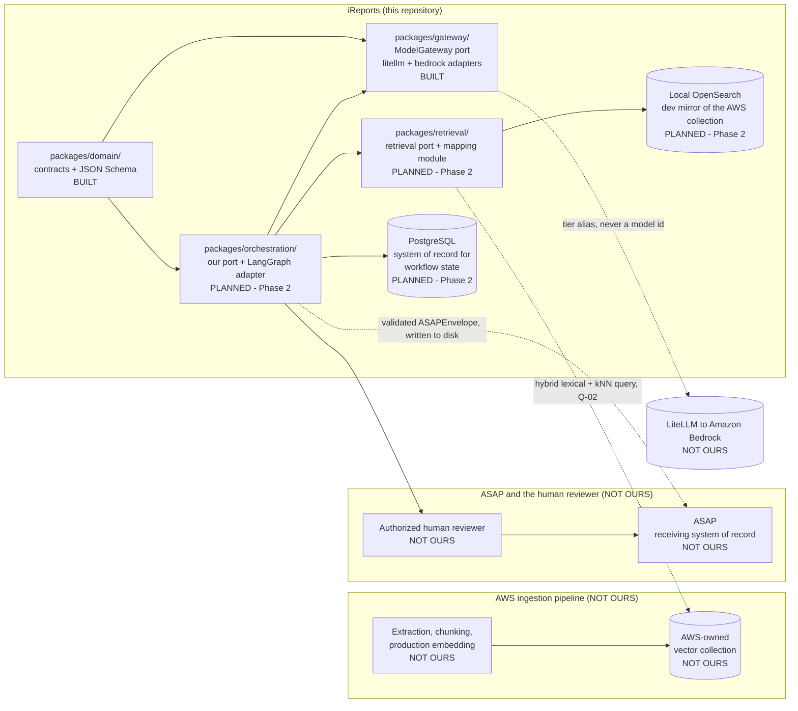
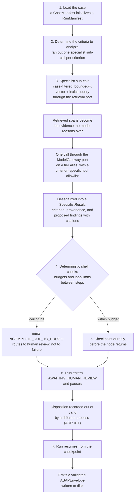

# Component Architecture

**Milestone 1a** · **Date: 2026-08-11** · **Status: complete — closes Milestone 1a**

This is the last item blocking program sign-off on Milestone 1a. It marks the component
boundaries of the iReports reference implementation — what is ours, what the AWS ingestion
pipeline owns, what ASAP owns, and where the human review gate sits — and it separately marks
what ADR-020 designed and did not build, so that "coming in a later phase" and "deliberately not
coming" are never left for a reader to infer.

> **Claim tagging**, as in `orchestration-landscape.md`. `[measured]` — reproduced on this
> machine and reproducible again. `[first-party]` — from this project's own source, package
> metadata, or official documentation, sourced in §7. `[secondary]` — a third party said it and it
> was not independently confirmed. `[unverified]` — could not be confirmed; treat as an open
> question, not a fact.

> **Build-state legend.** A distinct vocabulary from claim tagging, used side by side with it in
> the tables below: claim tags mark evidence confidence, build-state markers mark whether a
> component exists. `BUILT` — exists now; the row names a real path that resolves. `PLANNED` —
> scheduled; the row names the phase that delivers it. `NOT OURS` — owned by another party (the
> AWS ingestion pipeline, ASAP, or the human reviewer). `DESIGNED-NOT-BUILT` — cut by ADR-020 or
> ADR-021; the row names the reason. A reader must never have to guess which of these four applies
> to a given box.

---

## 1. What this document settles

This document marks the boundaries that matter: what belongs to iReports, what the AWS ingestion
pipeline owns, what ASAP owns, and where the human review gate sits. §2 draws those boundaries at
the level of packages and external systems. §3 opens the orchestrator box from §2 into its
workflow steps. §4 marks every component `BUILT`, `PLANNED`, `NOT OURS`, or `DESIGNED-NOT-BUILT`.
§5 accounts individually for everything ADR-020 designed and did not build. §6 states what remains
unresolved and what it costs to be wrong. None of this is a determination about a case — it is a
description of a system boundary.

**The deliverable is a proven architecture and a handoff package, not a product (ADR-001).**
Runnable code exists to make architectural claims verifiable. A decision that cannot be
demonstrated is a decision that has not been made, and every claim in this document is either
cited or explicitly marked with a claim tag rather than asserted bare.

**The decision-support boundary (`CLAUDE.md`) is a constraint on this architecture, not a policy
statement.** It shows up as structure, not as prose the reader has to trust:

- No universal person-risk score and no aggregate risk level appear on any contract, whatever the
  field is named (ADR-014).
- Every finding this system produces is a *proposed* finding until an authorized officer records a
  disposition.
- Nothing reaches ASAP without that disposition — no bypass, in any profile.
- Both the machine proposal and the human-approved version are retained.

These are properties of the contracts and the state machine described in §3, enforced by
`model_validator`s and tests, not by convention.

**Scope is the orchestrator spine (ADR-020). Three phases, not nine.** The buildable scope is:
one command loads a synthetic case, fans out to bounded specialist sub-calls through the
`ModelGateway` port on tier aliases, enforces budgets and loop limits in the deterministic shell,
survives a crash mid-fan-out and resumes in a separate process without double-paying for an
in-flight model call, pauses for a recorded human disposition, and emits a validated typed
envelope. Breadth across authorities, retrieval infrastructure, and delivery plumbing is designed
in this handoff and marked unbuilt rather than built thin — that is what §4 and §5 are for.

---

## 2. The outer level — system context

Three boundaries matter at this level, and a reader should be able to point at each of them
without reading past the diagram: where iReports stops and the AWS ingestion pipeline starts,
where iReports stops and ASAP starts, and where iReports stops and the human reviewer starts.

**Where the boundaries sit, one sentence each.** iReports queries the AWS-owned vector collection
directly and is a consumer of it, never a producer — the AWS ingestion pipeline owns extraction,
chunking, and production embedding, and iReports's own local ingestion exists only to develop
against (ADR-007). iReports writes a validated `ASAPEnvelope` to disk; ASAP owns everything that
happens to that envelope after it is written, including transport, storage, and any downstream
action (ADR-010). iReports pauses in an explicit `AWAITING_HUMAN_REVIEW` state and cannot proceed
past it by itself — a human reviewer, not this system, records the disposition that lets a run
resume (ADR-011).

Three statements this section makes explicitly, because a reader would otherwise assume the
opposite:

- **Retrieval is vector and lexical only, with no graph database in any milestone (ADR-006).**
  Reaffirmed during the discussion that produced this phase. Cross-document relationships and
  timelines are served by structured entities and dated events, not by a graph traversal.
- **Local ingestion, chunking, and embedding are development only.** AWS owns production embedding
  and iReports is a consumer of the collection it produces, not a producer of it (ADR-007).
- **Application code never references a concrete model id.** It names one of three tier aliases —
  `ireports-orchestrator`, `ireports-thinking`, `ireports-fast` — and the alias-to-model mapping
  lives in configuration, never in a contract or a node (ADR-008, ADR-017). `packages/gateway/`
  (the `ModelGateway` port and its `litellm` and `bedrock` adapters) is the only component
  permitted to call a model at all (ADR-015).

`packages/retrieval/` returns to the diagram above under ADR-021: an earlier version of this
scope cut retrieval entirely on the reasoning that a fixture could stand in for a search. That
reasoning was wrong about what this architecture demonstrates — a sub-agent's RAG search against
the case record is not incidental to the specialist sub-call, it is what the sub-call *is*. A
fixture-fed specialist would demonstrate a fan-out, not this system.

---

## 3. The inner level — inside the orchestrator

This opens the `ORCH` box from §2 into the workflow steps a single run passes through — what
kicks off a sub-agent call, what the sub-agent does with its retrieval query, where budgets are
checked, and where the run pauses for the human reviewer.

**The deterministic shell around probabilistic reasoning.** Schema validation, citation
validation, authority routing, policy-pack effectivity, and loop and termination limits are
ordinary code, not model behavior. The model reasons over retrieved evidence; it does not decide
control flow and it does not decide whether its own output is valid. Per-specialist ceilings exist
on model calls, tool calls, retrieved evidence, tokens, and wall clock, plus a no-progress
detector. A node that hits a ceiling emits `INCOMPLETE_DUE_TO_BUDGET`, which routes to human
review rather than to failure — a truncated analysis must stay visible to a reviewer rather than
quietly disappearing.

**Durability, stated as properties the architecture requires rather than as framework settings.**
State is durable before a node returns; nothing is carried in memory across a process boundary;
deserialized state is re-validated rather than trusted. Under LangGraph these land as
`durability="sync"` and strict checkpoint deserialization (ADR-012) — both are wrong by default
here and both are invisible when reading a graph, which is why ORCH-01 sets them in code with
tests rather than leaving them to configuration. `spikes/harness/src/ireports_spike_harness/port.py`
is prior art for this shape — an orchestration port that survived three independent
implementations during the Milestone 1c bake-off — cited here as evidence that the shape works,
not as a component; it is not promoted into `packages/`.

Two honest notes this section carries as claims, not as settled facts:

- **Model-call idempotency is owed and unbuilt.** A crash mid-fan-out currently re-runs an
  in-flight model call, measured at 11 of 24 trials under LangGraph and 12 of 24 hand-rolled
  `[measured]`. It is retained by ADR-020 as its most expensive keep and is delivered by ORCH-02 in
  Phase 2. Durable orchestration of paid sub-calls is not a proven claim while resuming can
  double-pay.
- **A refused sub-agent produces a `SpecialistResult` with an empty findings list**, which is
  indistinguishable at the artifact level from a criterion that came back clean. The distinction
  lives in the log, not in the contract (ADR-021 Consequence 2, VAL-02 reduced to logging). This is
  the weakest point in the spine, and this document says so rather than leaving a reader to
  discover it later.
