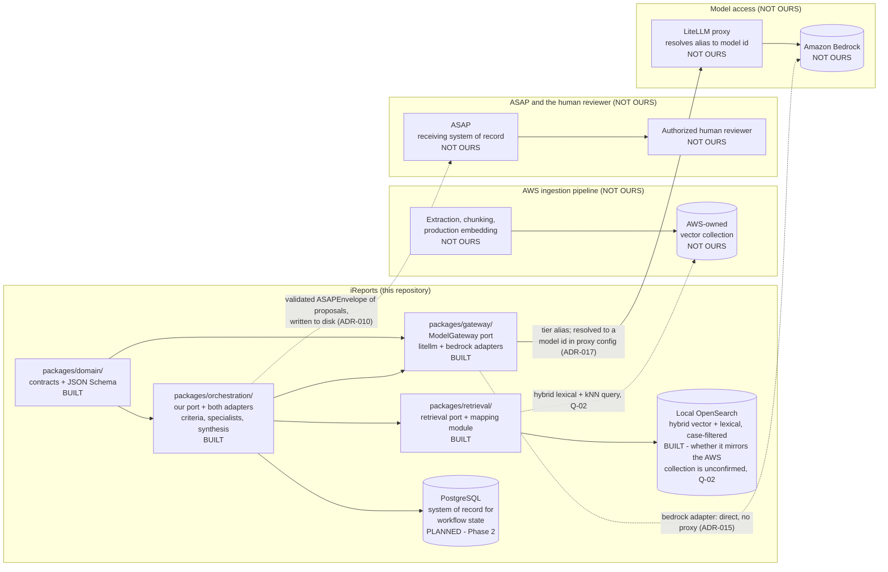
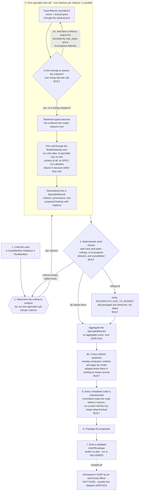

# Component Architecture

**Milestone 1a** · **Date: 2026-08-11** · **Status: complete — closes Milestone 1a**

This is the last item blocking program sign-off on Milestone 1a.

It answers two questions. **First: who owns what?** It draws the lines between the iReports
reference implementation, the AWS ingestion pipeline, ASAP, and the human reviewer. **Second: what
actually exists?** Every component is marked as built, planned, owned by someone else, or designed
and deliberately not built — so that "coming in a later phase" and "not coming at all" never look
alike.

**New to this project? Start with §0**, which explains what the system does in plain language and
defines the vocabulary the rest of the document uses.

---

## 0. How to read this document

### What the system does, in plain language

A case file arrives. The system looks up which rules apply to it, and for each rule it runs a
small, separate analysis: it searches the case documents for relevant passages, asks an AI model
to assess that one rule against those passages, and gets back a structured answer with pointers to
the exact text it relied on. It does this for every applicable rule, keeping a running count of
how much work it has done so it cannot run away.

It then packages what it found and hands it to ASAP. **The system never decides anything about a
person, and it never asks anyone anything** — it runs start to finish with no human involved, and
what it emits is a set of *proposed* items with evidence attached. An authorized officer reviews
those proposals **in ASAP**, using ASAP's own tooling, and whatever they decide is recorded there.

That division is the point: iReports is the analysis, ASAP is where judgment happens. An earlier
version of this architecture put a review pause inside the run itself; it was removed (ADR-022)
because it modelled a workflow this system does not have.

Everything else in this document is detail about where the pieces of that sit, which ones exist
today, and which ones were designed but deliberately not built.

### The vocabulary

This project uses a handful of words in specific ways. Several are borrowed from software
architecture and a few are ours. None of them are standard adjudication terms, so they are defined
here rather than left to context.

| Term | What it means here | Worth knowing |
|---|---|---|
| **Port** | An interface *we* define and our code calls, so whatever sits behind it can be replaced without changing the callers. | From "ports and adapters." **Not** a network port. Used 50+ times below — if a sentence says "through the port," read it as "through our own interface rather than calling the vendor directly." |
| **Adapter** | The swappable implementation behind a port. | `litellm` and `bedrock` are two adapters behind one model-access port. Swapping them is a config change, not a code change. |
| **The spine** | The narrow, end-to-end path: one case in, one validated package of proposals out. | Chosen over building broad-but-shallow features. It is the smallest slice that still touches every genuinely hard part. |
| **Fan out** | Start several small analyses at once — one per rule being checked — then collect the results. | This is the part that is architecturally hard, which is why it is the centre of the scope. |
| **Criterion** | One specific thing being checked under one named authority (e.g. SEAD-4 Guideline B). | **Not** a risk category or a score bucket. |
| **Specialist sub-call** | One bounded analysis of one criterion: search, one model call, one structured result. | "Specialist" means scoped to a single criterion, not a separate AI system. |
| **Deterministic shell** | The ordinary, non-AI code wrapped around each model call that decides what happens next — validation, budgets, loop limits, routing. | The rule it encodes: **the model reasons; the shell decides.** The model never controls flow or judges its own output. |
| **Tier alias** | A nickname for a *class* of model (`ireports-thinking`) instead of a specific model id. | Lets a model, region, or cloud partition change be a configuration change rather than a code change. |
| **Proposed finding** | Anything the machine produced that no human has ruled on yet. | Everything this system emits is "proposed." The word is load-bearing, not hedging. |
| **Disposition** | What an authorized officer decides about a proposed finding — accept, reject, or edit. | Happens **in ASAP, after iReports has finished**. iReports does not model, record, or wait for it (ADR-022). The word appears in older documents as an in-run step; that is superseded. |
| **Envelope** | The single typed package handed to ASAP at the end of a run. | Typed = its shape is checked by machine before it is allowed out. |
| **Checkpoint** | A durable save of the run's state, written before a step finishes. | So a crash can resume from the last good point instead of starting over. |
| **Durability** | The property that state is written down before a step returns; nothing important lives only in memory. | The thing checkpoints deliver. |
| **Double-paying** | Re-running a model call after a crash that was already made — and already billed. | Avoiding it is one of the two hardest problems in scope, and is still unbuilt. |
| **No-progress detector** | A check that halts a loop still running but no longer producing anything new. | A budget catches "too much"; this catches "spinning." |
| **Citation** | A pointer from a statement to the exact passage that supports it — either case evidence or policy text. | Enforced by code: an uncited claim is rejected before a human sees it. |
| **Policy pack** | A versioned bundle of approved authority text (the actual rules). | Versioned so you can tell which wording was in force when. |
| **Effectivity** | Which version of a policy pack applied on a given date. | Matters because a case is judged against the rules in force at the time. |
| **Authority routing** | Deciding which authorities legitimately apply to a given case. | A request to analyze something is not authorization to analyze it. |
| **`DESIGNED-NOT-BUILT`** | Worked out in enough detail to hand over, then deliberately not built. | The category that keeps "coming later" and "not coming" from looking alike. §5 lists every one. |

---

> **Claim tagging**, as in `orchestration-landscape.md`. `[measured]` — reproduced on this
> machine and reproducible again. `[first-party]` — from this project's own source, package
> metadata, or official documentation, sourced in §7. `[secondary]` — a third party said it and it
> was not independently confirmed. `[unverified]` — could not be confirmed; treat as an open
> question, not a fact.

> **Build-state legend.** A distinct vocabulary from claim tagging, used side by side with it in
> the tables below: claim tags mark evidence confidence, build-state markers mark whether a
> component exists. `BUILT` — exists now; the row names a real path that resolves. `PLANNED` —
> scheduled; the row names the phase that delivers it. `NOT OURS` — owned by another party (the
> AWS ingestion pipeline, ASAP, or the human reviewer). `DESIGNED-NOT-BUILT` — cut by ADR-020 or
> ADR-021; the row names the reason. A reader must never have to guess which of these four applies
> to a given box.
>
> **Edge legend.** The build-state markers above govern boxes; edges carry their own distinction.
> A **solid** edge is a dependency that exists today or is scheduled within the three-phase scope.
> A **dotted** edge crosses a boundary out of this repository, or depends on something unresolved —
> its label names which. Shape carries meaning too: `{{hexagons}}` are gates and branch points,
> `[(cylinders)]` are datastores, and plain boxes are components.

---

## 1. What this document settles

| Section | What you get from it | Read it if |
|---|---|---|
| §2 | The outside view — the boundaries drawn at the level of packages and external systems | You need to know who owns what |
| §3 | The inside view — the orchestrator box from §2 opened into the steps one run passes through | You need to know how a case actually flows |
| §4 | Every component marked `BUILT`, `PLANNED`, `NOT OURS`, or `DESIGNED-NOT-BUILT` | You need to know what exists today |
| [`build-guide.md`](build-guide.md) | Terms, process diagrams, the fan-out and branch patterns, the system prompts, conventions, build order | You are building the production system and want the shape and the reasoning rather than the inventory |
| §5 | Individual account of everything designed and deliberately not built, with the reason | You are picking up this work |
| §6 | What is still unresolved, and what it costs if we guessed wrong | You are assessing risk |

Nothing here is a determination about a case. This is a description of a system boundary.

**The deliverable is a proven architecture and a handoff package, not a product (ADR-001).**
Runnable code exists to make architectural claims verifiable. A decision that cannot be
demonstrated is a decision that has not been made, and every claim in this document is either
cited or explicitly marked with a claim tag rather than asserted bare.

**The system supports a decision. It never makes one.** That is not a policy promise written on
top of the architecture — it is built into the shape of the code, so it can be checked rather than
trusted:

- No universal person-risk score and no aggregate risk level appear on any contract, whatever the
  field is named (ADR-014).
- Every finding this system produces is a *proposed* finding. There is no other kind — the type
  is called `ProposedFinding` and nothing downstream of it can promote it to anything else.
- Every envelope is pinned `machine_generated: true` and carries no field claiming review,
  approval, or sign-off. It is un-reviewed by construction (ADR-022).
- A language guard rejects determinative wording — "is unsuitable", "should be denied",
  "violated SEAD-4" — on every text field, whether a model or a person wrote it.

These are enforced by validation code and tests, not by convention — meaning a change that broke
one of them would fail the test suite rather than pass unnoticed.

**Scope is the orchestrator spine (ADR-020). Three phases, not nine.** One command carries a
synthetic case all the way through, and that path has to do seven things:

1. Load the case and work out which criteria apply.
2. Run one bounded analysis per criterion, in parallel — each one searching the case documents,
   then making a single model call through our own interface rather than a vendor's.
3. Name models by tier (`ireports-thinking`), never by a specific model id.
4. Enforce its own ceilings — model calls, tokens, time, loop count — in ordinary code, outside
   the model's control.
5. Survive being killed partway through the fan-out, and resume in a *different process* without
   re-running (and re-paying for) a model call that was already in flight.
6. Run to completion unattended — no pause, no prompt, no human in the loop.
7. Emit one typed package of proposals, machine-validated before it leaves, for review in ASAP.

Item 5 is the genuinely hard one and is the reason the scope is shaped this way.

Everything else — breadth across many authorities, production retrieval infrastructure, delivery
plumbing — is **designed in this handoff and deliberately not built.** The choice was to build one
path completely rather than many paths thinly, because a thin version of the above would not have
proven anything. §4 marks what exists; §5 accounts for every piece that does not.

---

## 2. The outer level — system context

Three boundaries matter at this level, and a reader should be able to point at each of them
without reading past the diagram: where iReports stops and the AWS ingestion pipeline starts,
where iReports stops and ASAP starts, and — the sharpest of the three — that iReports never
touches the human reviewer at all.

Note what iReports has no edge to: **the reviewer.** There is no arrow from anything we build to a
person, because there is no point in a run where this system asks anyone anything. Our boundary
ends at the envelope. The officer reaches the proposals through ASAP, which is also where their
decision is recorded — none of that traffic crosses back into iReports (ADR-022).

**Where the boundaries sit, one sentence each.** In the target deployment iReports **will query**
the AWS-owned vector collection directly as a consumer, never a producer — `PLANNED`, and
untestable until Q-02 confirms the collection's real schema; nothing queries it today, and
RETR-01/RETR-02 build against local OpenSearch only (ADR-021 Decision 1). The AWS ingestion
pipeline owns extraction, chunking, and production embedding, and iReports's own local ingestion
exists only to develop against (ADR-007). iReports writes a validated `ASAPEnvelope` to disk; ASAP owns everything that
happens to that envelope after it is written, including transport, storage, and any downstream
action (ADR-010). iReports runs unattended from start to finish and has no reviewer-facing
surface at all: an authorized officer reviews the proposals in ASAP and records their decision
there, in ASAP's records, using ASAP's tooling (ADR-022).

Three statements this section makes explicitly, because a reader would otherwise assume the
opposite:

- **Retrieval is vector and lexical only, with no graph database in any milestone (ADR-006).**
  Reaffirmed during the discussion that produced this phase. Cross-document relationships and
  timelines are served by structured entities and dated events, not by a graph traversal.
- **Local ingestion, chunking, and embedding are development only.** AWS owns production embedding
  and iReports is a consumer of the collection it produces, not a producer of it (ADR-007).
- **Application code never references a concrete model id.** It names one of three tier aliases —
  `ireports-orchestrator`, `ireports-thinking`, `ireports-fast` — and the alias-to-model mapping
  lives in configuration, never in a contract or a node (ADR-008, ADR-017). `packages/gateway/`
  (the `ModelGateway` port and its `litellm` and `bedrock` adapters) is the only component
  permitted to call a model at all (ADR-015).

  **The invariant is narrower than "no model id reaches this repository."** ADR-017 Decision 2
  adds optional per-tier overrides (`IREPORTS_LITELLM_MODEL_ORCHESTRATOR|THINKING|FAST`) for the
  case where a shared organisational proxy does not carry our aliases. When one is configured, a
  concrete model id *does* live in this repository's configuration — and ADR-017's own
  Consequences say so: the ADR-015 claim that "with the LiteLLM adapter no model id reaches our
  repository at all" is conditional on the proxy carrying our aliases. What survives unconditionally
  is that **application code** names a tier and the **gateway** resolves it. The `bedrock` adapter
  goes direct with no proxy at all, which is why the diagram draws two edges out of `GATEWAY`.

`packages/retrieval/` returns to the diagram above under ADR-021: an earlier version of this
scope cut retrieval entirely on the reasoning that a fixture could stand in for a search. That
reasoning was wrong about what this architecture demonstrates — a sub-agent's RAG search against
the case record is not incidental to the specialist sub-call, it is what the sub-call *is*. A
fixture-fed specialist would demonstrate a fan-out, not this system.

---

## 3. The inner level — inside the orchestrator

This opens the `ORCH` box from §2 into the workflow steps a single run passes through — what
kicks off a sub-agent call, what the sub-agent does with its retrieval query, where budgets are
checked, and where the run ends. Note that it ends by emitting — there is no pause anywhere in it
(ADR-022).

**Every box in this diagram now resolves to real code.** It was drawn whole while three of them
did not, because the shape is what a government team is being asked to build; §4's build-state
table remains the authority, and the two are kept separate on the page rather than in a reader's
head. It is drawn whole because the shape is what a
government team is being asked to build; §4's build-state table is the authority on what resolves
to real code today. A design diagram that quietly reads as a status diagram is the specific way a
handoff overstates itself, so the two are separated on the page rather than in a reader's head.

Two properties are drawn rather than described, because they are the reason the spine exists
(ADR-020): the **fan-out** (`STEP2 -- per criterion --> SPECIALIST`, one instance per criterion)
and the **loop the limits bound** (`SHELL -- criteria remain --> STEP2`).

**Step 5 is drawn as a stage and is not one.** A node is checkpointed the moment it completes,
inside the node, which is what lets a crash mid-fan-out keep the specialists that finished; a
commit batched at the end of a stage would keep none of them. The box sits where it does because
every path to delivery — including the truncated one — passes through having checkpointed.

**A criterion the budget skipped is deliberately *not* checkpointed**, and that is the one place
this diagram's ordering could mislead. A criterion nobody attempted is the work the next invocation
exists to do; recording it as done would make the first invocation's ceiling permanent and report a
truncated case as a finished one.

The last node is deliberately drawn outside the flow and marked `NOT OURS`. Review is real and it
matters, but it is not a step in this state machine — the run reaches `DELIVERED` and ends,
whether or not anyone has looked at the result yet.

**Ordinary code wraps the AI, not the other way round.** This is the "deterministic shell" from
§0, and it is the central design choice: *the model reasons; the surrounding code decides.*
Concretely, all of the following are ordinary program logic that the model has no say in —
checking that its output has the right shape, checking that every claim carries a real citation,
deciding which authorities apply, deciding which version of the rules was in force, and deciding
when a loop has gone on long enough. The model reads evidence and forms an assessment. It does not
choose what happens next, and it does not get to rule on whether its own output is valid.

Each specialist analysis runs under ceilings — on model calls, tool calls, evidence retrieved,
tokens, and elapsed time — plus a check for a loop that is still running but no longer producing
anything new. A step that hits a ceiling does **not** fail. It reports
`INCOMPLETE_DUE_TO_BUDGET` and is packaged and delivered anyway rather than failing, because a
partial analysis that silently vanishes is worse than one a reviewer can see is partial. The
requirement was never that the run pause — only that the truncated result reach ASAP.

**Durability: what the architecture requires, stated before how any framework provides it.** Three
requirements, in plain terms: the run's state is written to durable storage before a step
finishes; nothing important is held only in memory between processes; and state read back after a
crash is re-validated rather than trusted to still be well-formed.

Under LangGraph those become the settings `durability="sync"` and strict checkpoint
deserialization (ADR-012). Both matter more than they look: **LangGraph's defaults are wrong for
us on both counts, and neither is visible when reading the workflow code.** That is why Phase 2
sets them explicitly with tests rather than leaving them to configuration where a future reader
would not notice them missing.

One clarification on a path you will see referenced: `spikes/harness/.../port.py` is prior art,
not a component. It is the interface shape that survived three independent implementations during
the Milestone 1c bake-off, cited as evidence the shape works. It is not promoted into
`packages/` and is not part of the delivered system.

Two honest notes this section carries as claims, not as settled facts:

- **Crash recovery still double-pays, and that is not yet fixed.** If the system dies partway
  through, resuming currently re-runs a model call that was already in flight — and already
  billed. Measured at 11 of 24 trials under LangGraph and 12 of 24 hand-rolled `[measured]`.
  ADR-020 kept this in scope as its single most expensive commitment; Phase 2 (ORCH-02) delivers
  it. **Until then, "durable orchestration of paid sub-calls" is not a claim this project can
  make.**
- **A refusal and a clean result look identical in the output.** When a sub-analysis declines to
  answer, it returns a result with an empty findings list — exactly what a criterion that found
  nothing returns. The two are told apart only in the logs, not in the data itself (ADR-021
  Consequence 2). **This is the weakest point in the design**, and it is stated here rather than
  left for someone to discover in six months.

---

## 4. Component build state

Every component in this system carries exactly one of the four markers defined above. Coverage:
the domain contracts and generated schemas, the model gateway and its three adapters, the
orchestration port and adapter, retrieval and the mapping module, the checkpoint store, ingestion,
the API and delivery surfaces, the spikes, the handoff documents, and the four not-ours systems.

**Contracts, schemas, and the gateway.**

| Component | Build state | Path | Notes |
|---|---|---|---|
| Domain contracts (twelve Pydantic v2 models) | `BUILT` | `packages/domain/src/ireports_domain/` | Contract set 2.0.0. Includes `SpecialistResult` / `SpecialistCriterion` (CONT-01); ADR-022 removed `HumanDisposition` and `ReviewSummary` |
| Generated JSON Schema | `BUILT` | `schemas/` | Regenerated by `scripts/generate_schemas.py`; `--check` runs in CI on every push (`.github/workflows/quality.yml`), which is what keeps `schemas/` and the models from diverging |
| Contract tests | `BUILT` | `tests/contract/` | 114 tests, including the ADR-014 schema-walking guard and the ADR-022 no-human-decision guard |
| `ModelGateway` port | `BUILT` | `packages/gateway/src/ireports_gateway/port.py` | The only component permitted to call a model (ADR-015) |
| `litellm` adapter | `BUILT` | `packages/gateway/src/ireports_gateway/adapters.py` | Default; Anthropic SDK against LiteLLM's native `/v1/messages` route (ADR-017) |
| `bedrock` adapter | `BUILT` | `packages/gateway/src/ireports_gateway/adapters.py` | Constructed and unit-tested; never run against a real endpoint in any partition (HAND-03, §5) |
| `stub` adapter | `BUILT` | `packages/gateway/src/ireports_gateway/adapters.py` | Offline, contract tests only; must never be selectable where findings reach a reviewer |

**Orchestration and retrieval — the spine Phase 2 builds.**

Each `PLANNED` row below names the **specific file** intended to hold it, not the package
directory. That is deliberate: when eight rows shared `packages/orchestration/`, the first commit
creating that directory would have failed all eight at once, and the flip rule stated after §4
would then have invited six `BUILT` claims for things that were not built (CR-02). One file per
row means one row flips per capability. The paths are the *intended* location — if Phase 2 lands
a capability somewhere else, update the row; the guard failing is the prompt to do so, not a
reason to move the code.

| Component | Build state | Path | Notes |
|---|---|---|---|
| Orchestration port (our own interface) | `BUILT` | `packages/orchestration/src/ireports_orchestration/port.py` | **ORCH-01 fully met 2026-08-18.** `RunResult`, the `Orchestrator` protocol, and the routing policy both adapters share. The checkpoint clauses (`durability="sync"`, strict deserialization) landed with the two rows below. The port shares only a connection string between the paths — a checkpointer is not a storage backend (ADR-026) |
| Orchestrator behind the port | `BUILT` | `packages/orchestration/src/ireports_orchestration/handrolled.py` | ADR-024. A thread pool and a loop, running the same shared specialist as the LangGraph adapter and asserted to produce identical output. What ORCH-05 called a second adapter and cut |
| Criteria selection from the case manifest | `BUILT` | `packages/orchestration/src/ireports_orchestration/criteria.py` | Fan-out width is runtime data, derived from `requested_analyses` × `policy_pack_ids`. **A stub for authority routing (ROUT-01), not the router** — it intersects what was asked with what the catalog offers and cannot decline or add a criterion |
| Multi-step evidence gathering (specialist loop) | `BUILT` | `packages/orchestration/src/ireports_orchestration/gather.py` | Roadmap item 6, ORCH-03. Retrieve → cheap fast-tier sufficiency triage → retrieve again, bounded by `max_steps`, `max_model_calls_per_node`, `max_evidence_per_node`, the run ledger, a **no-progress detector**, and a **cancellation token**. Seven distinct stop reasons, because a loop that cannot say why it stopped is one that looks like it found everything. Not a tool surface — SPEC-01's allowlist clause stays vacuous |
| Run trace (fan-out and branch evidence) | `BUILT` | `packages/orchestration/src/ireports_orchestration/trace.py` | Per-node start/end offsets recorded by both orchestrators and carried on `RunResult`, so a run **evidences** its own fan-out rather than a test asserting it. `peak_concurrency` is 3 on a five-criterion run — 1 would mean the fan-out is a loop. Identifiers and timings only; a test asserts the type can carry nothing else |
| Cross-criterion synthesis | `BUILT` | `packages/orchestration/src/ireports_orchestration/synthesis.py` | Evidence overlap computed by set arithmetic; contradictions and information gaps by one model call. Emits `ProposedFinding`s only — no summary, no ranking, no aggregate (ADR-014) |
| Node-level checkpointing | `BUILT` | `packages/orchestration/src/ireports_orchestration/checkpoint.py` | ORCH-01/ORCH-02. One row per completed node, JSON re-validated through the contracts on read, committed inside the node. A budget-skipped criterion is deliberately not recorded — it is the next invocation's work. Row integrity is a known gap (checkpoint-threat-model.md) |
| Model-call idempotency | `BUILT` | `packages/orchestration/src/ireports_orchestration/idempotency.py` | ORCH-02. A gateway decorator, so both orchestration paths get it in identical framework-free code. Crash harness measures **0 duplicate paid calls** across both paths and every crash point; `PostgresCallStore` proven across a real process boundary. Row integrity is a known gap (checkpoint-threat-model.md) |
| Deterministic budget/loop-limit shell | `BUILT` | `packages/orchestration/src/ireports_orchestration/budget.py` | ORCH-03. Run-level wall-clock and token ceilings that **stop the run**, not just record it — a crossed ceiling skips remaining criteria without a model call and the run reports which one. `Budgets` has no per-run model-call ceiling, only a per-node one; wall clock and tokens bound the run in practice |
| LangSmith egress-deny at every entry point | `PLANNED` | `packages/orchestration/src/ireports_orchestration/egress.py` | Phase 2, ORCH-04; extends `spikes/langgraph/test_langsmith_egress.py`'s negative control |
| Retrieval port and OpenSearch mapping module | `BUILT` | `packages/retrieval/src/ireports_retrieval/mapping.py` | RETR-01. Hybrid vector + lexical, mandatory case filter, bounded K. Header names Q-02; a test asserts no field name is written outside this module |
| Local ingestion of synthetic cases into OpenSearch | `BUILT` | `packages/retrieval/src/ireports_retrieval/index.py` | RETR-02. Development only (ADR-007) — AWS owns chunking and embedding in production. Records the embedding model per document so a corpus embedded by two models is detectable (Q-03) |
| Specialist sub-call | `BUILT` | `packages/orchestration/src/ireports_orchestration/specialist.py` | SPEC-01. Returns the published `SpecialistResult` contract; retrieves its own evidence; citations checked against what it was *shown*. **SPEC-01's tool-allowlist clause is vacuous rather than satisfied** — a specialist has no tool surface at all, so there is nothing to allowlist; the only capability it has is retrieval, bounded by the mandatory case filter |
| Refusal / `StructuredOutputError` logging | `PLANNED` | `packages/orchestration/src/ireports_orchestration/refusal_log.py` | Phase 2, VAL-02 (reduced to logging, ADR-021) |

**Typed output, delivery, and validation.**

ADR-022 removed the in-run review gate from this section. What stood here — a human disposition
contract, a run-state gate, a pause-and-resume across a process boundary, and a no-bypass proof —
described review as something iReports performed. It does not. Those rows are not `PLANNED` and
not `DESIGNED-NOT-BUILT`; they are **withdrawn**, because they specified a system that was never
the right one. §5's designed-not-built list is for work that was correctly specified and cut, and
mixing these in would misrepresent both.

| Component | Build state | Path | Notes |
|---|---|---|---|
| Run status state machine | `BUILT` | `packages/domain/src/ireports_domain/run.py` | No state waits for a person; every state can reach a terminal state unattended (ADR-022) |
| `ASAPEnvelope` contract | `BUILT` | `packages/domain/src/ireports_domain/asap.py` | Validated; pinned `machine_generated`, carries no review or approval field. The transport that would deliver it does not ship (DEL-01, §5) |
| Boundary guards in code | `BUILT` | `tests/contract/test_decision_support_boundary.py` | Asserts no contract models a human decision, no run state waits for one, and the envelope never claims review |
| One command, case to validated envelope | `PLANNED` | `apps/api/main.py` | Phase 3, DEL-02 |
| Synthetic cases with analyst-identified issues | `PLANNED` | `cases/synthetic/` | Phase 3, VAL-03 — the ground truth agreement is measured against |
| Ground-truth-free property scorer over saved runs | `BUILT` | `evals/scorers/properties.py` | Nine invariants, each descending from an incident that actually happened. Scores saved run files, so it costs nothing and is re-runnable as the checks improve. **Necessary, not sufficient** — a green board says well-formed, not correct |
| Agreement scorer — machine findings vs analyst findings | `PLANNED` | `evals/scorers/agreement.py` | Phase 3, VAL-04 — this is what "human validation" means here |

**Deployment fit.**

| Component | Build state | Path | Notes |
|---|---|---|---|
| Lambda cold start and packaging, measured under SAM local | `BUILT` | `spikes/lambda_fit/` | ARCH-03, closed by ADR-023. One function per bake-off candidate, built with real Linux wheels; ADR-012 stands |
| One case through a Lambda, end to end, against a real model | `BUILT` | `spikes/lambda_demo/` | ADR-023's one-invocation-with-in-process-fan-out shape, executing. Both orchestrators, real model calls, a validated `ASAPEnvelope` per run. Local `sam local invoke` only — not a deployment, and no checkpointer |
| Timeout-resume across a Lambda invocation boundary | `PLANNED` | `tests/end_to_end/test_lambda_timeout_resume.py` | Phase 2, LAMB-01. Depends on ORCH-02 — a Lambda timeout is a crash mid-fan-out, and today that re-runs an in-flight model call |

**Evidence base and the handoff package itself.**

| Component | Build state | Path | Notes |
|---|---|---|---|
| Orchestration bake-off (three candidates, all four legs) | `BUILT` | `spikes/` | Retained in full per ADR-001, losers included |
| Checkpoint-store threat model | `BUILT` | `docs/handoff/checkpoint-threat-model.md` | T1-T6; §6 lists controls not built |
| Model gateway handoff document | `BUILT` | `docs/handoff/model-gateway.md` | |
| Orchestration landscape scan | `BUILT` | `docs/handoff/orchestration-landscape.md` | |
| Orchestration scorecard | `BUILT` | `docs/handoff/orchestration-scorecard.md` | Resolves ADR-012 |
| Data contracts handoff document | `BUILT` | `docs/handoff/contracts.md` | Updated for CONT-01 |
| This document | `BUILT` | `docs/handoff/component-architecture.md` | Closes Milestone 1a (ARCH-01) |

**Not ours.**

| Component | Build state | Path | Notes |
|---|---|---|---|
| AWS ingestion pipeline (extraction, chunking, production embedding) | `NOT OURS` | — | Owned by the AWS ingestion pipeline team (ADR-007) |
| AWS OpenSearch-compatible vector collection | `NOT OURS` | — | Owned and populated by AWS ingestion; iReports is a consumer, never a producer (ADR-007) |
| ASAP | `NOT OURS` | — | The receiving system of record; owns the envelope after delivery (ADR-010) |
| Authorized human reviewer | `NOT OURS` | — | A person, not a software component. Reached through ASAP, never through iReports; their tooling, their role model, and the record of what they decide are all ASAP's (ADR-022) |

The tables above are enforced by `tests/architecture/test_build_state_table.py`. When Phase 2 or
Phase 3 creates a path a `PLANNED` row names, that row must be flipped to `BUILT` in the same
commit — the test failing at that point is the intended signal, not a nuisance. This instruction is
the entire reason D-11 exists: `CLAUDE.md`'s state narrative went stale in this repository once
before and nothing caught it.

**How far that enforcement actually reaches, stated rather than implied.** The test now runs on
every push (`.github/workflows/quality.yml`), alongside lint, types, the schema-currency check,
and the bake-off. That closes the specific hole this paragraph used to describe: the earlier
staleness went uncaught because the guard only ran when someone chose to run it.

It is still a guard against a reader being misled rather than a proof of correctness — it checks
that `BUILT` rows resolve and `PLANNED` rows do not yet exist, not that the prose around them is
true.

Within that limit the guard is now complete rather than partial. Every violation it can report is
asserted, and each one has a negative control proving it still fires — coverage is enforced by a
test, so adding a category without a failing example fails the suite. Both gaps recorded against
the first version (CR-01, CR-02 in `01-REVIEW.md`) are closed. Writing those controls also
surfaced a branch that no document text could reach: a path escaping the repository via a symlink,
which needs a filesystem to demonstrate and now has a test that builds one.

---

## 5. Designed and deliberately not built

A document that lists only what got done reads as complete when it is not. So this section lists
the opposite.

ADR-020 cut the plan from nine phases to three. Everything it removed is below, each row naming
the requirement id and why it was dropped. These are not oversights and not backlog — they were
worked out in enough detail to hand over, then deliberately left unbuilt. The point is that a
reader never has to guess whether something is **coming later** or **not coming at all**.
(`checkpoint-threat-model.md` §6 keeps its own honest list the same way.)

**RETR-01 and RETR-02 are not in this table.** ADR-021 restored them to the spine, so they appear
as `PLANNED` rows in §4 naming Phase 2, not as cuts — a reader comparing this document against
ADR-020's original cut table should not read their absence here as an omission.

**ARCH-03 is not in this table either, for the same reason.** ADR-020 cut it; ADR-023 measured it
and closed it. It appears in §4 as `BUILT`.

| Component | Build state | Path | Notes |
|---|---|---|---|
| Second orchestration adapter, one conformance suite over both | `DESIGNED-NOT-BUILT` | — | ORCH-05. The port plus ORCH-01's no-import test is the lock-in protection; a parallel implementation would double every downstream phase |
| Outcome-level scorecard comparing both adapters | `DESIGNED-NOT-BUILT` | — | BAKE-01. **Partly overtaken by ADR-024:** both paths are now live and run the same case in `spikes/lambda_demo/`, so a second adapter exists. What is still unbuilt is a scored outcome-level comparison |
| ADR-012's pre-registered supersession criteria | `DESIGNED-NOT-BUILT` | — | ARCH-05. Existed only to stop a bake-off from choosing its own rubric; the bake-off it would have gated (BAKE-01) is itself cut |
| Library and framework dependency inventory | `DESIGNED-NOT-BUILT` | — | ARCH-02. The dependency set is small and stable under the narrowed spine |
| Keyed MAC over serialized checkpoint state, verified on load | `DESIGNED-NOT-BUILT` | — | CKPT-01. The single largest recorded security gap; nothing today detects a tampered checkpoint row that still parses |
| Least-privilege checkpoint-write database role | `DESIGNED-NOT-BUILT` | — | CKPT-02. Hardening of a store the spine exercises unhardened |
| Resume provenance in the run manifest | `DESIGNED-NOT-BUILT` | — | CKPT-03. Recorded as "cheap to add; not added"; still true |
| Per-vector embedding provenance and a drift-detecting parity check | `DESIGNED-NOT-BUILT` | — | RETR-03. Stays cut under ADR-021 even though RETR-01/RETR-02 were restored; model-evaluation work, and Q-03's blast radius is unchanged for whoever builds it |
| `ChunkRecord` and `PolicyRecord` contracts | `DESIGNED-NOT-BUILT` | — | CONT-02. The indexed record shape lives inside the retrieval package rather than as a published contract; publishing it would commit a schema against an unconfirmed collection for no consumer outside retrieval |
| Authority routing with an explicit decision for every authority | `DESIGNED-NOT-BUILT` | — | ROUT-01. Breadth across authorities, not orchestrator risk; ADR-003's coverage decision is unchanged, its implementation is deferred |
| Two approved policy packs, policy fails closed | `DESIGNED-NOT-BUILT` | — | ROUT-02. Same reason as ROUT-01 |
| Deterministic citation and effectivity validators | `DESIGNED-NOT-BUILT` | — | VAL-01. Resolving citations needs a real evidence snapshot to mean anything; the finding contract still requires citations structurally |
| Transactional outbox, ASAP mock, `DeliveryReceipt` | `DESIGNED-NOT-BUILT` | — | DEL-01. The envelope contract stands and is validated; the transport that would deliver it does not ship |
| Q-01 closed by re-running the live smoke check in GovCloud | `DESIGNED-NOT-BUILT` | — | HAND-02. Externally blocked on account access regardless; Q-01 stays open and its cost is stated rather than guessed |
| The `bedrock` adapter exercised against a real endpoint | `DESIGNED-NOT-BUILT` | — | HAND-03. Verified as correctly constructed and nothing more; the green test suite must not be read as connectivity |

Three of these rows carry more weight than a table cell can hold and are stated here rather than
tabulated away:

**CKPT-01 is the single largest recorded security gap.** Nothing today would detect a tampered
checkpoint row that still parses. The spine exercises the checkpoint store unhardened, and that is
a deliberate, recorded cost rather than an oversight.

**ARCH-03 is closed, and was closed by measuring rather than by deciding it did not matter.**
ADR-020 cut it; ADR-023 restored and settled it. `spikes/lambda_fit/` packages each bake-off
candidate into a real Lambda container and times the orchestrator import: roughly 0.5 s for the
framework-free control against 1.6–2.3 s for LangGraph, about 3×, with packages of 9.1 MB and
19 MB zipped against a 50 MB limit. **ADR-012 stands** — dependency weight was the strongest
argument against LangGraph and the number does not support it. The figures are load-sensitive and
are stated as a range rather than a constant; see ADR-023 for what they are and are not.

**What remains unproven is the harder half.** The 15-minute Lambda ceiling is survivable because a
timeout is a crash mid-fan-out, and the shell checkpoints before the ceiling and resumes in the
next invocation — but that depends on ORCH-02, which is unbuilt and today re-runs an in-flight
model call in 11 of 24 crashes. Under Lambda this is worse than locally, because Lambda retries
automatically. LAMB-01 proves it in Phase 2.

**HAND-03, the `bedrock` adapter, has never been run in any partition.** It is verified as
correctly constructed and nothing more — a passing test suite is not evidence of connectivity, and
this document does not treat it as such.

ADR-020's own fourth consequence, stated here unhedged: the handoff package now carries more design
and less evidence than it would if breadth had shipped, so the unbuilt sections above say plainly
that they are unbuilt rather than implying otherwise.

---

## 6. What is unresolved, and what it costs to be wrong

Three questions are open, and all three are marked **GATE** in `docs/OPEN-QUESTIONS.md` — meaning
getting the answer wrong would invalidate real work, not just inconvenience it. "Blast radius"
below means how much would have to be rebuilt if the answer turns out to be different from what we
assumed.

Under ADR-020 none of the three blocks the current build, for a specific and slightly
uncomfortable reason: **the work that would have collided with them is not being built.** That
narrows what this project can claim. It does not resolve anything.

| Question | In plain terms | Why it is still open | If we are wrong |
|---|---|---|---|
| **Q-02** | What does the AWS search index actually look like? | No access to confirm it | Contained — all assumptions sit in one file, so adapting is a one-file change. Grows to high if the real structure is fundamentally different |
| **Q-03** | Does our search convert text to numbers the same way AWS's does? | Nothing local to compare against | **Silent.** A mismatch does not throw an error — it just returns worse results, with nobody told |
| **Q-01** | Are Claude models available in AWS GovCloud, and under what ids and routing rules? | Blocked on account access, outside this project's control | Unknown. Every model result so far comes from the commercial cloud and says nothing about GovCloud |

The detail behind each:

**Q-02 — the AWS vector collection schema.** Contained, not cleared. RETR-01 requires every field
name, filter, and facet mapping to live in one module whose header names Q-02 explicitly, so
adapting to the real AWS schema stays a one-file change (ADR-007). Containment is the only reason
proceeding under a working assumption about the collection shape is defensible; it is not a
substitute for confirming that shape. The blast radius grows from medium to high if the real shape
is structurally different — separate collections per corpus, or nested documents.

**Q-03 — query-time embedding parity.** Silent, and not a build gate. RETR-03 stays cut, so there
is no parity check and no embedding-provenance record. A mismatch between the query-time embedding
model and the model that populated the AWS collection does not error — it retrieves worse, and
every downstream retrieval number becomes meaningless without anyone being told. No
locally-measured retrieval quality from this codebase may ever be presented as predictive of AWS
behaviour.

**Q-01 — Claude model availability in AWS GovCloud.** Refuses any working assumption. All model
evidence gathered to date is commercial-partition only and says nothing about GovCloud — model
availability, concrete model and inference-profile ids, cross-region inference restrictions, and
data-routing rules there are all unvalidated. HAND-02, the work that would have closed it, is cut
(§5); the cost of not knowing is stated here rather than guessed at, and the question is externally
blocked on account access regardless of anything this project builds.

---

## 7. Sources

1. `docs/DECISIONS.md` — ADR-001, ADR-006, ADR-007, ADR-008, ADR-012, ADR-014, ADR-015,
   ADR-017, ADR-020, ADR-021, ADR-022, ADR-023 `[first-party]`. ADR-022 supersedes ADR-011; where an
   older handoff document describes an in-run review gate, this document is the current one.
2. `docs/OPEN-QUESTIONS.md` — Q-01, Q-02, Q-03 and their blast radius `[first-party]`.
3. `docs/ROADMAP.md` — what to build next and in what order (the GSD planning files it
   replaced were retired 2026-08-12 and are in git history) — the spine statement, the Phase 1 through
   Phase 3 success criteria, and the Gates section `[first-party]`.
4. `docs/REQUIREMENTS.md` § v2 § Cut by ADR-020 — the authoritative list of what is owed a
   `DESIGNED-NOT-BUILT` row and the reason for each `[first-party]`.
5. `docs/handoff/orchestration-scorecard.md` and `orchestration-scorecard.json` — the measured
   bake-off result that resolved ADR-012, including §5's list of what the bake-off did not measure
   `[measured]`.
6. `docs/handoff/orchestration-landscape.md` — the candidate-set scan that fed the bake-off
   `[first-party]`.
7. `docs/handoff/model-gateway.md` — the `ModelGateway` port, its adapters, and the refusal path
   `[first-party]`.
8. `docs/handoff/checkpoint-threat-model.md` — T1 through T6, and §6's list of controls not built,
   the source for the CKPT rows in §5 `[first-party]`.
9. `docs/handoff/contracts.md` — the contract set, the rule/mechanism/test table, and the deferred
   contracts this document's CONT-02 row also covers `[first-party]`.
10. `spikes/harness/src/ireports_spike_harness/port.py` — prior art for an orchestration port that
    survived three independent implementations, cited as evidence and not promoted into
    `packages/` `[first-party]`.
11. `CLAUDE.md` — the decision-support boundary and the rules that constrain code `[first-party]`.
